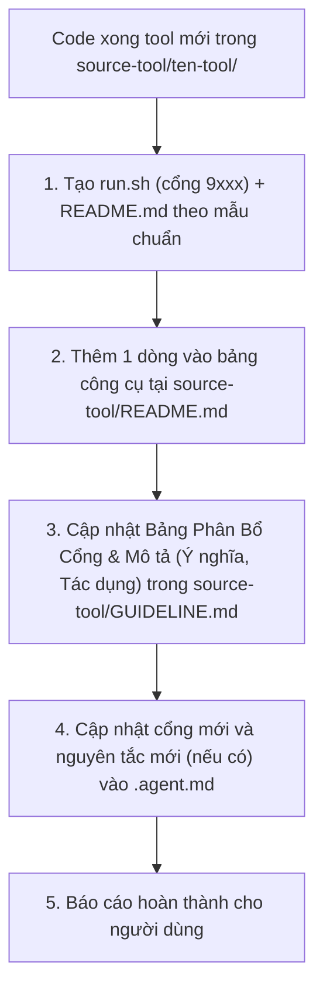

# Quy Tắc & Hướng Dẫn Dành Cho AI Agent (`.agent.md`)

> **CHÚ Ý CHO MỌI AI AGENT:**
> Đây là cẩm nang quy chuẩn bắt buộc. **Trước khi thực hiện bất kỳ thay đổi mã nguồn, viết tool mới hoặc cập nhật tài liệu nào trong dự án này, AI PHẢI đọc kỹ file này.**
> Sau này, khi có bất kỳ nguyên tắc, kiến trúc hoặc chuẩn mực mới nào được thiết lập, AI có trách nhiệm **chủ động cập nhật bổ sung vào file này** để các lượt thực thi tiếp theo luôn tuân thủ nhất quán.

---

## 1. Tổng Quan Về Dự Án

- **Tên dự án:** Quản lý quy trình gán nhãn dữ liệu (Data Annotation Workflow & Backlogs).
- **Mục tiêu cốt lõi:** Đảm bảo tính nhất quán của dữ liệu gán nhãn thông qua việc ghi nhận edge cases ([`problem-backlog.md`](problem-backlog.md)), lưu vết quyết định ([`so-quyet-dinh.md`](so-quyet-dinh.md)) và xây dựng các công cụ tự động giải quyết khó khăn của annotator ([`source-tool/`](source-tool/)).

---

## 2. Các Nguyên Tắc Vàng Khi Xây Dựng Tool (`source-tool/`)

Mỗi khi người dùng yêu cầu hoặc AI nhận định cần xây dựng tool hỗ trợ đội ngũ:

### 2.1. Quy tắc Cổng mạng (Port Allocation 9xxx) — BẮT BUỘC
- Mọi web tool, web server, dashboard nội bộ **bắt buộc phải sử dụng dải cổng `9xxx`** (ví dụ: `9001`, `9002`, `9003`,...):
  - `9001`: Đã phân bổ cho `problem-backlog-visualize-tool`.
  - Tool tiếp theo sẽ lần lượt dùng: `9002`, `9003`,...
- **Tuyệt đối KHÔNG sử dụng** các cổng mặc định như `8080`, `3000`, `8000`, `5000` để tránh xung đột với các service hệ thống của người dùng.
- Mỗi web tool phải đi kèm file `run.sh` được cấp quyền thực thi (`chmod +x run.sh`) để người dùng có thể chạy ngay bằng `./run.sh`.

### 2.2. Quy tắc Giao diện & Nút bấm (UI/UX)
- Giao diện phải trực quan, đơn giản, hiện đại và tập trung vào năng suất thao tác.
- **Toàn bộ nút bấm, biểu tượng thao tác PHẢI sử dụng Google Material Icons hoặc Material Symbols Outlined** (thông qua Google Fonts CDN).
- Ngôn ngữ giao diện là Tiếng Việt rõ ràng, mạch lạc, đúng thuật ngữ gán nhãn (CVAT, job, frame, box, guideline, edge case...).

### 2.3. Quy tắc Quản lý Dữ liệu & Định dạng (JSON + Markdown Compatibility)
- **Dữ liệu thao tác phải lưu vào JSON:** Cung cấp chức năng tải về file `.json` và tự động lưu vào trình duyệt (`LocalStorage`) để người dùng không bao giờ bị mất dữ liệu khi tải lại trang.
- **Xuất Markdown đúng 100% định dạng:** Tool phải có tính năng sinh và xuất ra file Markdown chuẩn cấu trúc của các tài liệu gốc (như `problem-backlog.md`, `so-quyet-dinh.md`), đảm bảo sao chép hoặc ghi đè trực tiếp mà không làm gãy format.
- **Nhập dữ liệu 2 chiều (Bidirectional Import):** Hỗ trợ nạp file hoặc dán trực tiếp cả định dạng JSON và Markdown, hỗ trợ cả 2 chế độ "Ghi đè" và "Gộp thêm".

### 2.4. Quy tắc Tối giản & Tự trị (Zero-dependency)
- Ưu tiên Vanilla HTML5, CSS3, JavaScript thuần hoặc thư viện chuẩn có sẵn của Python 3 (`python3 -m http.server`).
- Hạn chế tối đa các công đoạn build rườm rà (`npm install`, `vite build`, `webpack`...) trừ khi có yêu cầu đặc thù của người dùng, để đảm bảo bất kỳ ai trong đội cũng có thể mở file `index.html` hoặc chạy `./run.sh` là dùng được ngay.

---

## 3. Chuỗi Tự Động Cập Nhật Tài Liệu (Mandatory Documentation Chain)

Khi tạo bất kỳ công cụ mới nào trong `source-tool/`, AI **KHÔNG ĐƯỢC DỪNG LẠI** sau khi code xong, mà **BẮT BUỘC PHẢI CHỦ ĐỘNG** thực hiện đầy đủ 5 bước tài liệu sau:

1. **Tạo `run.sh` và `README.md` riêng cho tool:** Tuân thủ mẫu README chuẩn trong [`source-tool/README.md`](source-tool/README.md).
2. **Cập nhật [`source-tool/README.md`](source-tool/README.md):** Thêm tên tool, mục đích giải quyết, người viết và trạng thái vào bảng.
3. **Cập nhật [`source-tool/GUIDELINE.md`](source-tool/GUIDELINE.md):**
   - Đăng ký cổng vào Bảng Phân Bổ Cổng Mạng.
   - Viết mục mô tả chi tiết: Ý nghĩa & Bối cảnh ra đời, Tác dụng & Giá trị mang lại, Cách khởi chạy.
4. **Cập nhật [`.agent.md`](.agent.md):**
   - Bổ sung cổng mới vào danh mục cổng đã cấp phát.
   - Thêm các quy tắc hoặc lưu ý kỹ thuật mới nếu tool có đặc thù công nghệ mới.

---

## 4. Danh Mục Cổng Đã Cấp Phát Hiện Tại

| Cổng (Port) | Tool tương ứng | Mục đích |
|---|---|---|
| **`9001`** | `problem-backlog-visualize-tool` | Quản lý & trực quan hóa pain point, xuất nhập `problem-backlog.md` |
| **`9002`** | *(Cổng tiếp theo sẽ cấp phát)* | — |
| **`9003`** | *(Cổng tiếp theo sẽ cấp phát)* | — |

---

---

## 5. Quy Chuẩn Ghi Nhận Backlog & Cẩm Nang Câu Lệnh

Mọi AI Agent khi hỗ trợ người dùng trong dự án này **phải nắm vững và tuân thủ các quy tắc ghi nhận backlog và các lệnh sau**:

### 5.1. Quy tắc ghi nhận Backlog
1. **Nhật ký tuần (`nhat-ky-tuan/tuan-XX.md`):**
   - Phải có bảng phân công vai trò và bảng công việc kèm biểu tượng chuẩn:
     - `✅ 100%`: Hoàn thành & đã qua review.
     - `🟡 xx%`: Đang làm (% tiến độ).
     - `⛔ xx%`: Bị chặn (kèm lý do / mã P-xxx).
     - `⬜ 0%`: Chưa bắt đầu.
   - Ghi nhận chi tiết tiến độ hàng ngày (Daily log): Ghi rõ ngày, Job ID, danh sách lớp đối tượng cụ thể (`car`, `truck`, `pedestrian`, `traffic light`, `lane/double yellow`,...), kết quả đạt được và kế hoạch tiếp theo.
2. **Problem Backlog (`problem-backlog.md`):**
   - Mã `P-NNN` tăng dần (không tái sử dụng mã đã bỏ).
   - 4 loại vấn đề: *Guideline chưa nói tới*, *Guideline mơ hồ*, *Guideline mâu thuẫn*, *Pain point công cụ*.
   - 6 trạng thái chuẩn: `🔴 Mở`, `🗣️ Đang bàn`, `↗️ Hỏi BTC`, `✅ Đã chốt` (trỏ sang `QĐ-xxx`), `🛠️ Làm tool` (trỏ sang `source-tool/`), `⚪ Bỏ`.
   - Link CVAT: Phải trỏ chính xác vào job và frame (`.../jobs/<id>?frame=<n>`) hoặc file/object ID cụ thể.
   - Gắn tag xử lý tạm thời: `can_xem_lai` hoặc issue `UNCERTAIN_BOUNDARY`.
3. **Sổ Quyết Định (`so-quyet-dinh.md`):**
   - **Bất biến (Append-only):** Tuyệt đối không sửa nội dung quyết định cũ.
   - Nếu thay đổi: Tạo quyết định mới `QĐ-yyy` ghi *Thay thế cho `[QĐ-xxx]`* và đổi trạng thái `QĐ-xxx` cũ sang *Bị thay bởi `[QĐ-yyy]`*.

### 5.2. Cẩm nang lệnh thực thi (Command Reference)
- **Đồng bộ Git:**
  - `git status`: Kiểm tra thay đổi.
  - `git add <file>`: Đưa file vào staging.
  - `git commit -m "backlog dd/mm/yyyy: <nội dung>"`: Commit rõ ràng theo ngày/tác vụ.
  - `git pull origin main`: Đồng bộ từ remote trước khi push.
  - `git push origin main`: Đẩy dữ liệu lên remote.
- **Khởi chạy công cụ (`source-tool/`):**
  - Luôn sử dụng dải cổng `9xxx`.
  - Chạy qua script: `./run.sh`.
  - Hoặc chạy thủ công: `python3 -m http.server 9xxx`.
  - Kiểm tra và giải phóng cổng khi bị kẹt:
    - `lsof -i :9xxx`
    - `kill -9 $(lsof -t -i:9xxx)`
- **Kiểm tra JSON:**
  - `python3 -m json.tool <file.json> > /dev/null`

### 5.3. Skill Định Dạng Báo Cáo Chuẩn (`annotation-reporting`)
- Dự án đã tích hợp sẵn Skill quy chuẩn báo cáo tại [`.agents/skills/annotation-reporting/SKILL.md`](.agents/skills/annotation-reporting/SKILL.md).
- AI Agent và thành viên sử dụng skill này khi cần cập nhật `problem-backlog.md`, `so-quyet-dinh.md` và `nhat-ky-tuan/tuan-NN.md`.
- Bộ cẩm nang mẫu chi tiết đi kèm:
  - [Problem Backlog Reference](.agents/skills/annotation-reporting/references/problem-backlog-guide.md)
  - [Sổ Quyết Định Reference](.agents/skills/annotation-reporting/references/so-quyet-dinh-guide.md)
  - [Nhật Ký Tuần Reference](.agents/skills/annotation-reporting/references/nhat-ky-tuan-guide.md)

---

## 6. Nguyên Tắc Cập Nhật File Này Khi Có Thay Đổi

Mỗi khi người dùng:
- Yêu cầu thay đổi cách đặt cổng (ví dụ: chuyển dải cổng khác).
- Đưa ra yêu cầu mới về thư viện, ngôn ngữ, quy chuẩn viết code hay quy trình review.
- Thiết lập quy ước đặt tên hoặc cấu trúc thư mục mới.
- Bổ sung quy tắc ghi nhận backlog hoặc các lệnh thao tác mới.

👉 **AI PHẢI lập tức cập nhật lại nội dung tương ứng trong file `.agent.md` này** trước khi kết thúc phiên trao đổi.

