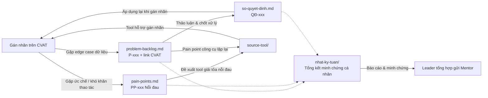

# Backlog Cá Nhân — G01-T006-Phạm Xuân Duy-2A202602093

Repo lưu trữ backlog và nhật ký làm việc cá nhân của học viên trong khuôn khổ dự án gán nhãn dữ liệu.

## Thông tin học viên & Đội

- **Mã học viên / Định danh repo:** `G01-T006-Phạm Xuân Duy-2A202602093`
- **Họ và tên:** Phạm Xuân Duy
- **Mã số sinh viên (MSSV):** `2A202602093`
- **Email:** `26ai.duypx@vinuni.edu.vn`
- **Lớp học phần:** AI Action khóa IV
- **Mã đội:** `T006` (Group 01)

## Mục đích của Backlog

Repo này phục vụ các mục đích chính:
1. **Ghi lại nhật ký công việc cá nhân:** Theo dõi tiến độ, nhiệm vụ được phân công, kết quả thực hiện và tỷ lệ hoàn thành qua từng tuần.
2. **Ghi nhận vấn đề và quyết định cá nhân:** Lưu vết các edge case ([`problem-backlog.md`](problem-backlog.md)) gặp phải khi thực hiện gán nhãn và các quyết định ([`so-quyet-dinh.md`](so-quyet-dinh.md)) xử lý/áp dụng.
3. **Cung cấp bằng chứng cá nhân:** Đóng vai trò làm minh chứng xác thực về công việc và đóng góp cá nhân của Duy.
4. **Hỗ trợ Leader tổng hợp:** Giúp Leader dễ dàng theo dõi, tổng hợp dữ liệu chuẩn hóa của thành viên để báo cáo và gửi Mentor.

## Có gì trong repo

| Đường dẫn | Dùng để | Tần suất cập nhật |
|---|---|---|
| [`nhat-ky-tuan/`](nhat-ky-tuan/) | Nhật ký phân công, tiến độ công việc và kết quả cá nhân theo từng tuần | Đầu tuần nhận việc, cuối tuần chốt |
| [`problem-backlog.md`](problem-backlog.md) | Ghi nhận các edge case gặp phải khi gán nhãn mà guideline chưa trả lời được, kèm link CVAT | **Ngay khi gặp** |
| [`so-quyet-dinh.md`](so-quyet-dinh.md) | Những gì cá nhân/đội đã chốt thống nhất và lý do | Mỗi lần chốt một vấn đề |
| [`pain-points.md`](pain-points.md) | Sổ ghi nhận nỗi đau, khó khăn thể chất/tâm lý, rào cản công cụ và quy trình của annotator | Khi phát sinh nỗi đau |
| [`Kinh_Nghiem_Label_Thuc_Chien.md`](Kinh_Nghiem_Label_Thuc_Chien.md) | Cẩm nang kinh nghiệm 10.000 giờ cho người mới bắt đầu: thứ tự layer, mẹo CVAT, xử lý occluded/truncated | Tài liệu hướng dẫn thực chiến |
| [`source-tool/`](source-tool/) | Source code công cụ tự viết để gỡ pain point hoặc tăng tốc khi gán nhãn | Khi phát triển/cập nhật tool |

## Luồng xử lý & Liên kết tài liệu



## Quy tắc ghi nhận & Quản lý Backlog

Nhằm đảm bảo dữ liệu minh bạch, nhất quán và bất kỳ ai (thành viên mới, Lead, Mentor hay AI) cũng có thể đọc hiểu và thực hiện đúng, toàn bộ việc ghi chép backlog tuân theo các quy tắc chuẩn hóa sau:

### 1. Quy ước định danh & Liên kết cơ bản
- **Mã định danh:** `P-001`, `P-002`... cho vấn đề/edge case; `QĐ-001`, `QĐ-002`... cho quyết định. Đánh số tăng dần 3 chữ số, **tuyệt đối không dùng lại số của mục đã huỷ/bỏ**.
- **Nhắc thành viên:** Sử dụng handle GitHub chính thức, ví dụ `@thanh-vien-a`, `@spameverytime`.
- **Dẫn link bằng chứng CVAT:** Bắt buộc trỏ đích danh tới đúng **job và frame** (`.../jobs/<id>?frame=<n>`) hoặc đường dẫn file ảnh kèm ID đối tượng (`w1/bbox_polygon/G01/G01_B026.jpg — đối tượng car ID 110`). Không trỏ chung chung tới task.
- **Đối chiếu Guideline:** Luôn chỉ rõ số mục tài liệu (ví dụ `§3.2`, `§4.2`, `§5`) để người đọc kiểm chứng nhanh.

---

### 2. Quy tắc ghi Nhật ký tuần (`nhat-ky-tuan/`)
Mỗi tuần làm việc có 1 file riêng (`tuan-01.md`, `tuan-02.md`...).
- **Đầu tuần:** Ghi rõ thông tin cá nhân, phân công vai trò (Annotator / Reviewer) và Job được giao.
- **Trạng thái công việc:** Thể hiện bằng 4 biểu tượng chuẩn hóa:
  - `✅ 100%`: Đã hoàn thành **và đã qua review nghiệm thu**.
  - `🟡 xx%`: Đang thực hiện (ghi rõ % ước lượng).
  - `⛔ xx%`: Bị chặn (ghi rõ nguyên nhân, ví dụ: chờ chốt `[P-002]`).
  - `⬜ 0%`: Chưa bắt đầu.
- **Tiến độ hàng ngày (Daily log):** Cuối mỗi ngày, ghi chép cụ thể:
  - Mã Job đang làm (ví dụ: `Job 1351`).
  - Các lớp đối tượng (classes) cụ thể đã hoàn tất: phương tiện (`car`, `truck`...), người (`pedestrian`, `bicycle`...), biển báo/đèn (`traffic light`, `traffic sign`...), vạch đường (`lane/double yellow`, `lane/single white`...).
  - Kế hoạch thực hiện ca tiếp theo.
- **Tổng kết tuần:** Thống kê số ảnh đã gán, tỷ lệ đạt review lần 1, danh sách mã `P-xxx` mới phát hiện và kế hoạch tuần tới.

---

### 3. Quy tắc ghi Problem Backlog (`problem-backlog.md`)
Ghi nhận **ngay lập tức khi phát hiện** edge case hoặc sự cố công cụ.

#### 4 Loại vấn đề chuẩn hóa:
1. **Guideline chưa nói tới:** Tình huống thực tế phát sinh mà guideline không đề cập.
2. **Guideline mơ hồ:** Guideline có nhắc nhưng câu chữ dẫn đến 2 cách hiểu trở lên.
3. **Guideline mâu thuẫn:** Hai mục khác nhau trong guideline quy định trái ngược nhau.
4. **Pain point công cụ:** Guideline rõ ràng nhưng thao tác trên CVAT tốn quá nhiều thời gian hoặc dễ nhầm lẫn.

#### 6 Trạng thái xử lý:
- 🔴 **Mở:** Mới ghi nhận, đang chờ phân tích.
- 🗣️ **Đang bàn:** Đội đang thảo luận tìm phương án.
- ↗️ **Hỏi BTC:** Đã gửi câu hỏi lên BTC/Mentor, chờ phản hồi chính thức.
- ✅ **Đã chốt:** Đã thống nhất giải pháp, **bắt buộc dẫn link trỏ sang `[QĐ-xxx]` trong `so-quyet-dinh.md`**.
- 🛠️ **Làm tool:** Chuyển sang phát triển công cụ tự động, trỏ link sang thư mục trong `source-tool/`.
- ⚪ **Bỏ:** Không cần xử lý (bắt buộc ghi rõ lý do hủy).

#### Gắn cờ xử lý tạm (Temporary Handling):
Trong lúc chờ chốt, annotator phải áp dụng giải pháp tạm thời và gắn nhãn cờ trên CVAT:
- Gắn tag `can_xem_lai` trên frame/đối tượng để lọc ra sửa nhanh sau này.
- Hoặc tạo issue dạng `UNCERTAIN_BOUNDARY` khi biên đối tượng mờ/không xác định rõ.

---

### 4. Quy tắc ghi Sổ Quyết Định (`so-quyet-dinh.md`)
Lưu trữ mọi thỏa thuận kỹ thuật đã chốt trong đội ngũ.
- **Nguyên tắc bất biến (Append-only):** **Tuyệt đối không chỉnh sửa nội dung của quyết định cũ đã ban hành.**
- **Cơ chế cập nhật / Thay đổi ý định:** Nếu một quyết định cũ không còn phù hợp:
  1. Tạo quyết định mới `QĐ-yyy` ghi rõ nguyên nhân và nội dung mới.
  2. Tại `QĐ-yyy`, ghi chú: *Thay thế cho `[QĐ-xxx]`*.
  3. Cập nhật trạng thái của `QĐ-xxx` cũ thành: `Bị thay bởi [QĐ-yyy]`.
- **Cấu trúc 1 mục quyết định:** Phải gồm đủ: Ngày · Người tham gia (@chốt, @thành viên) · Xuất phát từ (`[P-xxx]` hoặc cuộc họp) · Bối cảnh phát sinh · Các phương án cân nhắc (phân tích ưu/nhược, ghi rõ **Chọn** hoặc Loại) · Quyết định dứt khoát · Danh sách việc phải làm theo (`- [ ] việc (@người phụ trách)`).

---

### 5. Quy tắc ghi Sổ Pain Points (`pain-points.md`)
Ghi nhận các trở ngại thao tác, ức chế công cụ, mệt mỏi thể chất/tinh thần và bất cập quy trình của annotator.
- **Mã định danh:** `PP-001`, `PP-002`... tăng dần liên tục, không dùng lại mã đã hủy.
- **5 Phân loại chuẩn:**
  1. *🛠️ Công cụ & Hạ tầng:* Lỗi CVAT giật lag, timeout, mất dữ liệu, thiếu phím tắt.
  2. *📘 Đặc tả & Guideline:* Quy định mơ hồ, thiếu ảnh mẫu đối chiếu visual do/don't.
  3. *🩺 Thể chất & Thao tác:* Mỏi mắt, đau mỏi cổ tay (RSI) do click chuột liên tục hàng trăm lần.
  4. *⚖️ Review & Phản hồi:* Reviewer đánh giá cảm tính, thiếu chuẩn sai số định lượng, trả feedback chậm.
  5. *📷 Chất lượng Dữ liệu:* Ảnh mờ, thiếu sáng, lóa đèn, góc quay bị khuất.
- **4 Mức độ tác động:** `🚨 Nghiêm trọng` (Critical) · `⚠️ Cao` (High) · `⚡ Trung bình` (Medium) · `💡 Thấp` (Low).
- **4 Trạng thái chuẩn:** `🔴 Đang gặp` · `🟡 Giải pháp tạm` (phải có Workaround) · `🛠️ Đang làm tool` (trỏ `source-tool/`) · `✅ Đã giải quyết`.
- **Cấu trúc 1 mục:** Tóm tắt · Phân loại & Mức độ · Người báo cáo & Tần suất · Triệu chứng & Bối cảnh · Nguyên nhân gốc rễ · Tác động thực tế (thời gian/năng suất) · Giải pháp tạm thời (Workaround) · Đề xuất dài hạn (Tool/Guideline) · Trạng thái.

---

## Cẩm nang câu lệnh thực thi (Command Reference)

Dưới đây là các câu lệnh chuẩn hóa được sử dụng xuyên suốt trong quá trình làm việc, phát triển công cụ và đồng bộ backlog:

### 1. Đồng bộ & Cập nhật tiến độ Git
```bash
# 1. Kiểm tra trạng thái các file đã thay đổi
git status

# 2. Thêm file cần cập nhật vào vùng chuẩn bị
git add problem-backlog.md so-quyet-dinh.md nhat-ky-tuan/

# Hoặc thêm toàn bộ thay đổi
git add .

# 3. Commit với thông điệp rõ ràng theo ngày/nội dung
git commit -m "backlog 17/9/2026: cập nhật tiến độ Job 1351 và P-010"
# Hoặc commit theo quy chuẩn conventional:
# git commit -m "docs: cập nhật nhật ký tuần 01 ngày 17/09"
# git commit -m "feat(tool): thêm tính năng export markdown"

# 4. Kéo cập nhật mới nhất từ kho lưu trữ (tránh xung đột)
git pull origin main

# 5. Đẩy dữ liệu lên GitHub
git push origin main
```

### 2. Khởi chạy & Vận hành công cụ nội bộ (`source-tool/`)
Mọi công cụ web nội bộ đều tuân thủ dải cổng **`9xxx`** để không xung đột hệ thống:

```bash
# === Cách 1: Khởi chạy nhanh bằng script tiện ích (Khuyến nghị) ===
cd source-tool/problem-backlog-visualize-tool
./run.sh

# === Cách 2: Khởi chạy trực tiếp bằng Python 3 ===
cd source-tool/problem-backlog-visualize-tool
python3 -m http.server 9001
```
> Mở trình duyệt tại: `http://localhost:9001`

### 3. Xử lý sự cố cổng mạng (Khi cổng `9xxx` bị chiếm dụng)
Nếu gặp lỗi `Address already in use` khi khởi chạy tool:
```bash
# Kiểm tra tiến trình nào đang chiếm cổng 9001
lsof -i :9001
# (hoặc): ss -tulpn | grep 9001

# Giải phóng cổng (buộc dừng tiến trình đang giữ cổng)
kill -9 $(lsof -t -i:9001)
```

### 4. Kiểm tra tính toàn vẹn dữ liệu JSON
Trước khi commit các file dữ liệu công cụ, kiểm tra cú pháp JSON:
```bash
python3 -m json.tool source-tool/problem-backlog-visualize-tool/problem-backlog.json > /dev/null && echo "JSON hợp lệ!"
```

