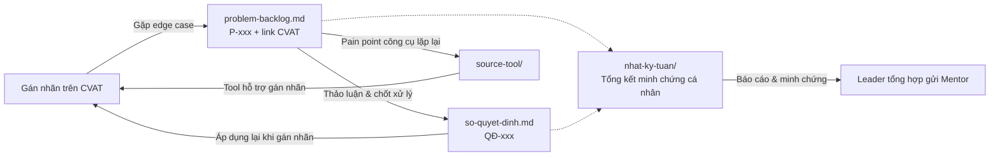

# Backlog Cá Nhân — G01-T006-Phạm Xuân Duy-2A202602093

Repo lưu trữ backlog và nhật ký làm việc cá nhân của học viên trong khuôn khổ dự án gán nhãn dữ liệu.

## Thông tin học viên & Đội

- **Mã học viên / Định danh repo:** `G01-T006-Phạm Xuân Duy-2A202602093`
- **Họ và tên:** Phạm Xuân Duy
- **Mã số sinh viên (MSSV):** `2A202602093`
- **Mã đội:** `T006` (Group 01)

## Mục đích của Backlog

Repo này phục vụ các mục đích chính:
1. **Ghi lại nhật ký công việc cá nhân:** Theo dõi tiến độ, nhiệm vụ được phân công, kết quả thực hiện và tỷ lệ hoàn thành qua từng tuần.
2. **Ghi nhận vấn đề và quyết định cá nhân:** Lưu vết các edge case ([`problem-backlog.md`](problem-backlog.md)) gặp phải khi thực hiện gán nhãn và các quyết định ([`so-quyet-dinh.md`](so-quyet-dinh.md)) xử lý/áp dụng.
3. **Cung cấp bằng chứng cá nhân:** Đóng vai trò làm minh chứng xác thực về công việc và đóng góp cá nhân của Duy.
4. **Hỗ trợ Leader tổng hợp:** Giúp Leader dễ dàng theo dõi, tổng hợp dữ liệu chuẩn hóa của thành viên để báo cáo và gửi Mentor.

## Có gì trong repo

| Đường dẫn | Dùng để | Tần suất cập nhật |
|---|---|---|
| [`nhat-ky-tuan/`](nhat-ky-tuan/) | Nhật ký phân công, tiến độ công việc và kết quả cá nhân theo từng tuần | Đầu tuần nhận việc, cuối tuần chốt |
| [`problem-backlog.md`](problem-backlog.md) | Ghi nhận các edge case gặp phải khi gán nhãn mà guideline chưa trả lời được, kèm link CVAT | **Ngay khi gặp** |
| [`so-quyet-dinh.md`](so-quyet-dinh.md) | Những gì cá nhân/đội đã chốt thống nhất và lý do | Mỗi lần chốt một vấn đề |
| [`source-tool/`](source-tool/) | Source code công cụ tự viết để gỡ pain point hoặc tăng tốc khi gán nhãn | Khi phát triển/cập nhật tool |

## Luồng xử lý & Liên kết tài liệu

## Quy ước ghi nhận

- **Mã:** `P-001`, `QĐ-001`, đánh số tăng dần. Không dùng lại số của mục đã bỏ.
- **Nhắc người:** Sử dụng handle GitHub, ví dụ `@thanh-vien-a`.
- **Link CVAT:** Trỏ tới đúng job và frame (`.../jobs/<id>?frame=<n>`), không trỏ tới cả task — giúp người xem mở ra là thấy ngay vị trí vấn đề làm bằng chứng trực tiếp.
- **Mục guideline:** Ghi rõ số mục (ví dụ `§3.2`) để dễ đối chiếu.
