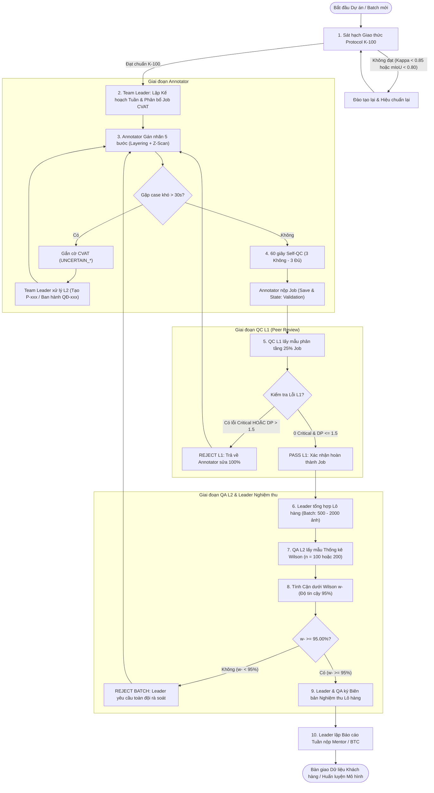

# QUY TRÌNH VẬN HÀNH TIÊU CHUẨN & GUIDELINE KIỂM SOÁT CHẤT LƯỢNG (SOP)
## Dành cho Team Leader, Đội ngũ Annotation, QC (L1) và QA (L2)
### Dự án Computer Vision: 2D BBox, Polygon, Polyline & Semantic Segmentation

> **Tài liệu Quy chuẩn Kỹ thuật • AI20K • G01-T006**  
> *Phiên bản 1.1 • Ban hành: 2026*  
> *Áp dụng bắt buộc cho toàn bộ Team Leaders, Annotators, Peer Reviewers (QC L1), Tech Leads (QA L2) và Project Managers*

---

## Mục lục

1. [Tổng quan & Mục tiêu Cốt lõi](#1-tổng-quan--mục-tiêu-cốt-lõi)
2. [Ma trận Phân định Trách nhiệm (RACI Matrix Toàn diện)](#2-ma-trận-phân-định-trách-nhiệm-raci-matrix-toàn-diện)
3. [Giao thức Hiệu chuẩn K-100 (Protocol K-100 Gate)](#3-giao-thức-hiệu-chuẩn-k-100-protocol-k-100-gate)
4. [Quy chuẩn Taxonomy, Schema & Thang đo Sai số](#4-quy-chuẩn-taxonomy-schema--thang-đo-sai-số)
5. [Quy trình Quản trị & Điều hành Dành riêng cho Team Leader](#5-quy-trình-quản-trị--điều-hành-dành-riêng-cho-team-leader)
6. [Quy trình Chi tiết dành cho Annotator & Tự Kiểm soát (Self-QC)](#6-quy-trình-chi-tiết-dành-cho-annotator--tự-kiểm-soát-self-qc)
7. [Quy trình QC L1: Lấy mẫu & Kiểm soát Chất lượng Sơ cấp](#7-quy-trình-qc-l1-lấy-mẫu--kiểm-soát-chất-lượng-sơ-cấp)
8. [Quy trình QA L2: Kiểm định Thống kê với Khoảng tin cậy Wilson](#8-quy-trình-qa-l2-kiểm-định-thống-kê-với-khoảng-tin-cậy-wilson)
9. [Giao thức Phân cấp Xử lý Sự cố & Ngoại lệ (Escalation Protocol)](#9-giao-thức-phân-cấp-xử-lý-sự-cố--ngoại-lệ-escalation-protocol)
10. [Sơ đồ Luồng Vận hành Tổng thể (End-to-End Workflow)](#10-sơ-đồ-luồng-vận-hành-tổng-thể-end-to-end-workflow)
11. [Biểu mẫu Báo cáo & Nghiệm thu Lô Hàng (Acceptance Sign-off)](#11-biểu-mẫu-báo-cáo--nghiệm-thu-lô-hàng-acceptance-sign-off)
12. [Tài liệu Tham chiếu & Liên kết Hệ thống](#12-tài-liệu-tham-chiếu--liên-kết-hệ-thống)

---

## 1. Tổng quan & Mục tiêu Cốt lõi

Dữ liệu huấn luyện thị giác máy tính (Computer Vision) quyết định trực tiếp tới khả năng nhận thức và an toàn của các mô hình học sâu (Deep Learning: YOLO, Mask R-CNN, BEVFormer, SegFormer...). Một sai lệch nhỏ trong nhãn gán có thể dẫn đến việc mô hình nhận diện sai vật thể hoặc phản xạ bất thường trong thực tế.

Tài liệu này xác lập quy chuẩn kỹ thuật toàn diện nhằm đạt 4 mục tiêu cốt lõi:
1. **Tuân thủ tuyệt đối Taxonomy & Schema:** Không tự tạo, đổi tên, ghép lớp hoặc gán nhãn ngoài danh mục đã được quy định trong [`Annotation_Guideline_BBox_Polygon_Polyline_v1.md`](Annotation_Guideline_BBox_Polygon_Polyline_v1.md) và [`Semantic_Segmentation_Annotation_Guideline.md`](Semantic_Segmentation_Annotation_Guideline.md).
2. **Độ chính xác & Tính nhất quán cao (Consistency):** Đảm bảo tính đồng thuận cao giữa các nhân sự gán nhãn khác nhau (Inter-Annotator Agreement - IAA $\ge 0.85$).
3. **Kiểm định Thống kê Khoa học (Statistical Rigor):** Ứng dụng **Khoảng tin cậy Wilson (Wilson Score Interval)** để đưa ra quyết định nghiệm thu/từ chối lô dữ liệu có căn cứ toán học, loại bỏ hoàn toàn việc đánh giá cảm tính.
4. **Xử lý Ngoại lệ Khép kín (Closed-loop Escalation):** Triệt tiêu hiện tượng "đoán mò" bằng cơ chế dừng 30 giây, gắn cờ CVAT chuẩn hóa và đồng bộ hóa với [`problem-backlog.md`](problem-backlog.md) & [`so-quyet-dinh.md`](so-quyet-dinh.md).
5. **Điều hành Nhất quán của Leader:** Thiết lập quy chế vận hành hàng ngày và hàng tuần cho Team Leader, kết nối nhịp nhàng giữa thành viên thực thi, đội ngũ kiểm thử QC/QA và Mentor/BTC.

---

## 2. Ma trận Phân định Trách nhiệm (RACI Matrix Toàn diện)

Để đảm bảo quy trình vận hành trơn tru và không chồng chéo trách nhiệm, mỗi giai đoạn trong vòng đời dữ liệu được chuẩn hóa theo mô hình RACI:
- **R (Responsible):** Người trực tiếp thực hiện nhiệm vụ.
- **A (Accountable):** Người chịu trách nhiệm cuối cùng về kết quả và có quyền phê duyệt.
- **C (Consulted):** Người được tham vấn chuyên môn hai chiều.
- **I (Informed):** Người được thông báo kết quả.

| Công đoạn / Nhiệm vụ | Annotator | Peer QC (L1) | Team Leader | Tech Lead / QA (L2) | Project Manager / Mentor |
|---|:---:|:---:|:---:|:---:|:---:|
| **1. Đào tạo & Thi sát hạch K-100** | **R** | C | **A** | **A** | I |
| **2. Phân bổ Job CVAT & Lập kế hoạch tuần** | I | I | **A / R** | C | I |
| **3. Gán nhãn Production & Self-QC (60s)** | **A / R** | I | I | I | I |
| **4. Lấy mẫu & Kiểm định QC L1 (25%)** | I | **R** | **A** | C | I |
| **5. Trả hàng & Sửa lỗi (Rework)** | **R** | **A** | C | I | I |
| **6. Quản trị Edge Cases (`problem-backlog.md`)** | **R** (tạo issue) | C | **A / R** | C | I |
| **7. Họp kỹ thuật & Ban hành Quyết định (`so-quyet-dinh.md`)** | C | C | **R** | **A** | **A** |
| **8. Quản trị Sổ Pain Points (`pain-points.md`) & Tooling** | C (báo lỗi) | I | **A / R** | C | I |
| **9. Kiểm định Thống kê Wilson QA L2 (Acceptance)** | I | C | C | **R** | **A** |
| **10. Tổng hợp Báo cáo Tuần & Ký nghiệm thu lô** | I | I | **R** | C | **A / R** |

---

## 3. Giao thức Hiệu chuẩn K-100 (Protocol K-100 Gate)

Giao thức **Protocol K-100** là cơ chế kiểm định năng lực bắt buộc trước khi bất kỳ nhân sự nào được phân bổ vào các Job sản xuất (Production Tasks).

```
┌─────────────────────────┐     Không đạt
│  Bộ Đề Chuẩn K = 100    │ ─────────────────┐
│ (Golden / Benchmark Set)│                  │
└────────────┬────────────┘                  ▼
             │                      ┌─────────────────┐
             ▼                      │ Đào tạo lại     │
┌─────────────────────────┐         │ (Re-training)   │
│ Đánh giá Chỉ số Định    │         └────────┬────────┘
│ lượng: Kappa, IoU, mIoU │                  │
└────────────┬────────────┘                  │
             │                               │
             ▼                               │
   Đạt ngưỡng chuẩn?                         │
   ├── Có ──────────────────────────┐        │
   └── Không ───────────────────────┼────────┘
                                    ▼
                        ┌────────────────────────┐
                        │ Cấp chứng chỉ Pass     │
                        │ Phân bổ Job Production │
                        └────────────────────────┘
```

### 3.1. Cấu trúc Tập dữ liệu Chuẩn K-100 (Golden Benchmark Dataset)
Tập K-100 gồm chính xác **100 khung hình (frames)** được Tech Lead và Mentor gán nhãn Ground Truth (GT) hoàn hảo, bao gồm:
- **40 frames Dễ (Baseline):** Điều kiện ánh sáng ban ngày rõ ràng, mật độ phương tiện thưa, đường thẳng, góc nhìn chuẩn.
- **35 frames Trung bình (Challenging):** Bị che khuất một phần (Occluded > 30%), mép ảnh cắt viền (Truncated), thời tiết mưa/ngược sáng.
- **25 frames Khó & Edge Cases (Complex):** Đêm tối có ánh đèn pha lóa, bóng đổ phức tạp, người điều khiển xe (`rider`) đan xen người đi bộ (`pedestrian`), dải phân cách và làn đường bị mòn/mất vạch.

### 3.2. Tiêu chí Đánh giá & Ngưỡng Vượt qua (Pass Thresholds)

Để vượt qua Protocol K-100, học viên/annotator phải đồng thời thỏa mãn 4 chỉ số định lượng:

1. **Độ chính xác gán nhãn (Classification Accuracy):**
   $$\text{Acc} = \frac{\text{Số object đúng class}}{\text{Tổng số object GT}} \ge 98.0\%$$
2. **Độ đồng thuận liên gán nhãn viên (Cohen's Kappa / Fleiss' Kappa):**
   $$\kappa = \frac{P_o - P_e}{1 - P_e} \ge 0.85$$
   *(Trong đó $P_o$ là tỷ lệ quan sát thống nhất, $P_e$ là xác suất thống nhất ngẫu nhiên).*
3. **Độ khít Bounding Box (Intersection over Union - IoU):**
   $$\text{IoU} = \frac{\text{Area}(B_{\text{pred}} \cap B_{\text{gt}})}{\text{Area}(B_{\text{pred}} \cup B_{\text{gt}})} \ge 0.85 \quad (\text{Trung bình toàn bộ box})$$
4. **Độ chính xác Semantic Segmentation (mean IoU - mIoU):**
   $$\text{mIoU} = \frac{1}{C} \sum_{c=1}^C \frac{TP_c}{TP_c + FP_c + FN_c} \ge 0.80$$
5. **Giới hạn Lỗi Nghiêm trọng (Fatal Error Cap):** **0 lỗi Critical** (không được phép bỏ sót người đi bộ hoặc nhầm lẫn giữa mặt đường và vỉa hè).

### 3.3. Quy định Re-calibration (Hiệu chuẩn Định kỳ)
- **Chu kỳ kiểm tra:** Sau mỗi **500 ảnh production** hoàn thành, annotator sẽ được hệ thống chèn ngẫu nhiên (blind injection) 5 ảnh Golden Set để kiểm tra duy trì phong độ.
- **Khi cập nhật Guideline:** Bất cứ khi nào có quyết định kỹ thuật mới (`QĐ-xxx`) làm thay đổi định nghĩa class hoặc cách vẽ biên, toàn đội phải thực hiện bài mini-calibration $K=20$ trước khi tiếp tục làm việc.

---

## 4. Quy chuẩn Taxonomy, Schema & Thang đo Sai số

### 4.1. Hệ thống Taxonomy Chuẩn hóa

#### Task 1: 2D Bounding Box, Polygon & Polyline (Tổng cộng 19 Classes)
- **Object Instance (10 Classes - BBox):** `pedestrian`, `rider`, `car`, `truck`, `bus`, `train`, `motorcycle`, `bicycle`, `traffic light`, `traffic sign`.
  - *Attributes bắt buộc:* `occluded` (true/false), `truncated` (true/false).
- **Drivable Area (2 Classes - Polygon):** `area/drivable`, `area/alternative`.
- **Lane Marking (7 Classes - Polyline):** `lane/crosswalk`, `lane/double white`, `lane/double yellow`, `lane/road curb`, `lane/single other`, `lane/single white`, `lane/single yellow`.

#### Task 2: Semantic Segmentation (Tổng cộng 19 Classes)
- **19 Classes:** `road`, `sidewalk`, `building`, `wall`, `fence`, `pole`, `traffic_light`, `traffic_sign`, `vegetation`, `terrain`, `sky`, `person`, `rider`, `car`, `truck`, `bus`, `train`, `motorcycle`, `bicycle`.
- **Ba Quy tắc Bất biến (Core Rules):**
  - **RULE 01:** Mỗi pixel thuộc tối đa 1 class. Không được phép overlap.
  - **RULE 02:** Biên mask phải bám đúng theo bằng chứng thị giác nhìn thấy. Không vẽ đoán.
  - **RULE 03:** Nếu không chắc chắn, tạo Issue review; tuyệt đối không ép vào class gần giống để "lấp kín ảnh".

---

### 4.2. Phân loại Mức độ Lỗi & Thang Điểm Trừ (Defect Severity Matrix)

Chất lượng của một frame ảnh hoặc job được lượng hóa thông qua **Tổng điểm phạt (Demerit Points - DP)**:

$$\text{DP} = \sum (N_{\text{Critical}} \times 10) + \sum (N_{\text{Major}} \times 3) + \sum (N_{\text{Minor}} \times 1)$$

| Mức độ Lỗi | Định nghĩa | Ví dụ Cụ thể | Trọng số phạt |
|---|---|---|:---:|
| **🚨 Critical (Lỗi Chí Mạng / Fatal)** | Lỗi làm hỏng cấu trúc dữ liệu, sai lệch nghiêm trọng nhận thức AI hoặc bỏ sót đối tượng an toàn quan trọng. | • Bỏ sót `pedestrian`, `rider`, phương tiện đang di chuyển.<br>• Sai class giữa các nhóm cơ bản (nhầm người thành xe, nhầm xe con thành xe bus).<br>• Tự ý tạo class mới hoặc đổi tên class ngoài schema.<br>• Semantic mask bị chồng lấn (overlap) hoặc rỗng nền diện rộng.<br>• BBox bị lệch hoàn toàn khỏi đối tượng ($\text{IoU} < 0.50$). | **10 điểm / lỗi**<br>*(1 lỗi = Trả về toàn lô ngay lập tức)* |
| **⚠️ Major (Lỗi Nặng)** | Lỗi ảnh hưởng đáng kể đến độ chính xác hình học và ngữ nghĩa của mô hình. | • BBox vẽ lỏng lẻo ($\text{IoU}$ từ $0.70$ đến $0.84$), bỏ sót gương xe hoặc cắt lẹm bánh xe.<br>• Quên bật cờ attribute `occluded` hoặc `truncated` khi đối tượng bị che/cắt mép rõ ràng.<br>• Nhầm lẫn các class tương đồng (`car` vs `truck`, `wall` vs `fence`, `road` vs `sidewalk`).<br>• Polyline làn đường bị lệch tim $> 5\text{px}$ hoặc vẽ polygon thay cho polyline.<br>• Drivable area polygon bị tự cắt (self-intersection). | **3 điểm / lỗi** |
| **💡 Minor (Lỗi Nhẹ)** | Sai lệch nhỏ về thẩm mỹ hoặc biên hình học không ảnh hưởng lớn đến nhận diện tổng thể. | • Biên polygon/mask lệch nhẹ $2 - 3\text{px}$ ở góc khuất.<br>• Thừa/thiếu một vài điểm anchor point trên đoạn thẳng của polyline.<br>• BBox hơi rộng hơn $1 - 2\text{px}$ so với viền thực tế.<br>• Nhầm lẫn giữa `area/drivable` và `area/alternative` ở khu vực mép đường chưa rõ vạch. | **1 điểm / lỗi** |

---

## 5. Quy trình Quản trị & Điều hành Dành riêng cho Team Leader

Team Leader là hạt nhân kết nối giữa chiến lược chất lượng của dự án và kết quả thực thi của từng Annotator. Để đảm bảo toàn đội vận hành nhịp nhàng, đúng hạn và không ai bị bỏ lại phía sau, Leader phải tuân thủ nghiêm ngặt 5 trách nhiệm trụ cột sau:

### 5.1. Phân bổ Công việc & Điều phối Năng suất Định lượng (Work Allocation)
Tiến độ của đội **tuyệt đối không được ước lượng cảm tính**, mà phải dựa trên công thức Work Units chuẩn hóa đã quy định trong [`annotation-reporting`](.agents/skills/annotation-reporting/SKILL.md):

- **Tổng đơn vị công việc chuẩn hóa:**
  $$W_{\text{job}} = N_{\text{ảnh}} \times K_{\text{nhãn}} \quad (K_{\text{nhãn}} = 19)$$
- **Nguyên tắc phân bổ của Leader:**
  1. **Chỉ giao Job khi thành viên đã Pass K-100:** Không phân bổ job production cho nhân sự chưa đạt ngưỡng chuẩn.
  2. **Cân bằng tải theo năng lực:** Annotator mới giao batch nhỏ (20 - 30 ảnh/lần); Annotator kinh nghiệm giao batch 50 - 100 ảnh.
  3. **Phân cặp Peer Review chéo (QC L1):** Leader chỉ định rõ ràng ai là Reviewer cho ai, nghiêm cấm tự review job của chính mình.
  4. **Theo dõi Burn-down Chart hàng ngày:** Nếu thành viên có tiến độ bị tắc nghẽn (`⛔ xx%` hoặc đứng im quá 24h), Leader phải can thiệp ngay để tháo gỡ khó khăn.

---

### 5.2. Quản trị Ngoại lệ & Điều hành Sổ Quyết Định (Escalation Governance)
Leader là đầu mối tiếp nhận và điều phối tầng Escalation Cấp 2 (L2):

1. **Rà soát CVAT Issues hàng ngày:**
   - Kiểm tra các cờ `[UNCERTAIN_*]` do annotator gắn trên frame CVAT.
   - Nếu là case đã có quy tắc sẵn: Phản hồi giải thích ngay cho annotator trong vòng **15 phút**.
   - Nếu là case mới: Lập hồ sơ `P-xxx` vào [`problem-backlog.md`](problem-backlog.md) trong vòng **2 giờ** (đầy đủ phân loại, link CVAT frame và ảnh chụp minh chứng).
2. **Chủ trì Họp Kỹ thuật & Ban hành Quyết định:**
   - Khi có các vấn đề cần bàn thảo (`🗣️ Đang bàn` hoặc `↗️ Hỏi BTC`), Leader tổ chức họp nhanh 15 phút với toàn đội.
   - Thống nhất phương án và soạn thảo mã `QĐ-xxx` vào [`so-quyet-dinh.md`](so-quyet-dinh.md) theo nguyên tắc **Bất biến (Append-only)**.
   - Cập nhật liên kết 2 chiều giữa `P-xxx` và `QĐ-xxx`.
   - Thông báo toàn đội qua kênh chat và kiểm tra việc áp dụng vào thực tế.

---

### 5.3. Quản trị Nỗi đau Annotator & Phát triển Công cụ (Pain Point & Tooling Governance)
Năng suất và tỷ lệ lỗi gắn liền với tâm lý, thể chất và công cụ làm việc của annotator:

1. **Lắng nghe & Lưu vết Sổ Pain Points:**
   - Định kỳ kiểm tra [`pain-points.md`](pain-points.md). Khi annotator phản ánh mỏi mắt, đau cổ tay, CVAT lag hoặc thao tác lặp đi lặp lại vô nghĩa, Leader lập ngay mã `PP-xxx`.
2. **Chỉ đạo Phát triển Tool Hỗ trợ (`source-tool/`):**
   - Chuyển hóa các `PP-xxx` có độ nghiêm trọng cao (`🚨 Nghiêm trọng` hoặc `⚠️ Cao`) thành đề xuất trong [`source-tool/tool-ideas.md`](source-tool/tool-ideas.md).
   - Đôn đốc hoặc trực tiếp tham gia xây dựng công cụ, tuân thủ nghiêm ngặt quy định tại [`.agent.md`](.agent.md):
     - Dải cổng mạng nội bộ: **`9xxx`** (ví dụ: `9001`, `9002`...).
     - Có script thực thi `run.sh` và `README.md` theo chuẩn.
     - Cập nhật đầy đủ vào chuỗi tài liệu dự án (`source-tool/GUIDELINE.md` và `.agent.md`).

---

### 5.4. Nhịp Vận hành Chuẩn của Leader (Leader Operating Cadence)

Leader thực thi kỷ luật vận hành theo lịch trình cố định:

```
┌─────────────────────────────────────────────────────────────────────────────┐
│                      LỊCH TRÌNH VẬN HÀNH HÀNG NGÀY                          │
├─────────────────┬───────────────────────────────────────────────────────────┤
│ 08:30 - 08:45   │ Daily Standup (15 phút): Rà soát mục tiêu ngày, tháo gỡ   │
│                 │ các blocker (⛔), phân bổ job CVAT.                        │
├─────────────────┼───────────────────────────────────────────────────────────┤
│ 11:30 - 12:00   │ Kiểm tra tiến độ buổi sáng & Rà soát CVAT Issues (SLA L2).│
│                 │ Cập nhật problem-backlog.md nếu có case mới.              │
├─────────────────┼───────────────────────────────────────────────────────────┤
│ 16:30 - 17:00   │ Kiểm tra tỷ lệ Reject của QC L1. Nếu có thành viên bị     │
│                 │ reject nhiều, trực tiếp 1-on-1 hướng dẫn lại.             │
├─────────────────┼───────────────────────────────────────────────────────────┤
│ 17:30 - 18:00   │ Rà soát Daily Log của thành viên trong nhat-ky-tuan/.     │
│                 │ Đảm bảo 100% thành viên ghi nhận đúng cú pháp Append-only.│
└─────────────────┴───────────────────────────────────────────────────────────┘
```

```
┌─────────────────────────────────────────────────────────────────────────────┐
│                      LỊCH TRÌNH VẬN HÀNH HÀNG TUẦN                          │
├─────────────────┬───────────────────────────────────────────────────────────┤
│ Thứ Sáu (Chiều) │ Chốt sổ gán nhãn tuần; kiểm tra toàn bộ QC L1 đã duyệt.   │
│                 │ Gửi Lô dữ liệu sang Tech Lead / QA L2 để Audit Wilson.    │
├─────────────────┼───────────────────────────────────────────────────────────┤
│ Thứ Bảy (Sáng)  │ Nhận kết quả kiểm định QA L2:                             │
│                 │ • Nếu Pass (w- >= 95%): Chuẩn bị hồ sơ nghiệm thu.        │
│                 │ • Nếu Reject: Kích hoạt Rework Protocol khẩn cấp.         │
├─────────────────┼───────────────────────────────────────────────────────────┤
│ Chủ Nhật        │ Tổng hợp Báo cáo tuần toàn đội: Tính % sản lượng chuẩn,   │
│                 │ tổng hợp danh sách P-xxx, QĐ-xxx, PP-xxx nộp Mentor/BTC.  │
└─────────────────┴───────────────────────────────────────────────────────────┘
```

---

### 5.5. Tổng hợp Báo cáo Tiến độ Toàn Đội nộp Mentor / BTC
Vào cuối mỗi tuần, Leader trích xuất dữ liệu từ các file cá nhân [`nhat-ky-tuan/tuan-NN.md`](nhat-ky-tuan/) để tổng hợp thành **Báo cáo Tiến độ Tuần của Đội**, bao gồm:
1. **Bảng tổng hợp % hoàn thành từng thành viên** (tính theo công thức chuẩn Work Units).
2. **Danh sách các mã `P-xxx` mới phát hiện trong tuần** và tình trạng xử lý.
3. **Danh sách các `QĐ-xxx` mới ban hành.**
4. **Các pain points nổi cộm và tiến độ phát triển công cụ hỗ trợ.**
5. **Biên bản kiểm định thống kê Wilson của QA L2.**

---

### 5.6. Bộ Checklist Hành động của Leader (Leader Action Checklist)

```markdown
### CHECKLIST HÀNG TUẦN CỦA TEAM LEADER:

[ ] 1. KIỂM SOÁT NHÂN SỰ & ONBOARDING:
    - 100% nhân sự gán nhãn đã vượt qua bài thi Protocol K-100 chưa?
    - Có thành viên nào cần re-calibration định kỳ (sau 500 frame) không?

[ ] 2. KIỂM SOÁT PHÂN BỔ & TIẾN ĐỘ:
    - Toàn bộ ảnh đã được chia Job rõ ràng trên CVAT chưa?
    - Tỷ lệ % tiến độ có được tính tự động dựa trên N_ảnh x 19 classes không?
    - Không có thành viên nào bị treo ở trạng thái ⛔ xx% quá 24h?

[ ] 3. KIỂM SOÁT BACKLOG & SỔ QUYẾT ĐỊNH:
    - 100% Issue CVAT dạng UNCERTAIN_* đã được phản hồi hoặc tạo P-xxx chưa?
    - Các P-xxx đã chốt đều có liên kết chuẩn tới QĐ-xxx tương ứng?
    - Sổ quyết định tuân thủ nguyên tắc Bất biến (Append-only)?

[ ] 4. KIỂM SOÁT CHẤT LƯỢNG & QA AUDIT:
    - Tỷ lệ lấy mẫu QC L1 đạt tối thiểu 25% mỗi Job?
    - Lô dữ liệu tuần đã được QA L2 kiểm định bằng công thức Wilson chưa?
    - Cận dưới khoảng tin cậy Wilson đạt w- >= 95.00% trước khi nộp bài?
```

---

## 6. Quy trình Chi tiết dành cho Annotator & Tự Kiểm soát (Self-QC)

### 6.1. Chiến thuật Gán nhãn Chuẩn 5 Bước (Battle-tested 5-Step Workflow)
Để tối ưu năng suất và triệt tiêu lỗi thao tác, Annotator phải tuân thủ nghiêm ngặt cẩm nang thực chiến [`Kinh_Nghiem_Label_Thuc_Chien.md`](Kinh_Nghiem_Label_Thuc_Chien.md):

1. **Bước 0: Quét toàn cảnh 3 giây & Cân chỉnh ánh sáng (Scene Scan):**
   - Xác định thời tiết, ngày/đêm, điểm tụ (Vanishing Point).
   - Chỉnh độ sáng (Brightness +10-20%) và tương phản (Contrast +10%) trên CVAT nếu ảnh tối/ngược sáng.
2. **Bước 1: Chiến thuật Layering (Từ Nền $\rightarrow$ Tiền Cảnh):**
   - Vẽ Lớp 1: Drivable Area, Sidewalk, Sky (Polygon / Mask).
   - Vẽ Lớp 2: Lane Markings (Polyline).
   - Khóa layer (`Lock - L`) hoặc hạ Opacity xuống 20% trước khi vẽ vật thể nổi.
3. **Bước 2: Nguyên tắc Kích thước (Từ Lớn $\rightarrow$ Nhỏ):**
   - Vẽ xe tải, xe buýt lớn trước để làm "mỏ neo thị giác" (Visual Anchors).
   - Vẽ xe con $\rightarrow$ Xe máy, xe đạp $\rightarrow$ Người đi bộ cuối cùng.
4. **Bước 3: Quét không gian có hệ thống (Z-Scan & Depth Outward):**
   - Không nhìn đâu vẽ đó. Quét theo đường ziczac hoặc từ điểm tụ xa nhất ra hai mép cận cảnh.
5. **Bước 4: Thực hiện 60 giây Self-QC:**
   - Chạy bộ tiêu chí "3 KHÔNG - 3 ĐỦ" trước khi chuyển sang ảnh mới.

---

### 6.2. Checklist 60 giây Self-QC (Tự kiểm tra trước khi chuyển ảnh)

```markdown
[ ] 1. KHÔNG SÓT (No Missing):
    - Đã quét kỹ 2 mép biên ảnh để bắt các xe/người bị cắt mép chưa?
    - Đã quét điểm tụ xa xôi để bắt các chấm xe nhỏ li ti chưa?
    - Đã kiểm tra người đi bộ núp sau bóng râm / gốc cây chưa?

[ ] 2. KHÔNG THỪA (No False Positive):
    - Đã loại bỏ hình in quảng cáo trên thân xe tải/buýt (không dán pedestrian) chưa?
    - Đã loại bỏ bóng đổ (drop shadow) và hình phản chiếu trên mặt đường/kính chưa?
    - Đã bấm phím H (Hide/Unhide) để xóa các box rác vô tình click nhầm chưa?

[ ] 3. KHÔNG LỎNG (No Loose Box):
    - Cạnh box đã chạm sát điểm ngoài cùng của vật chưa?
    - Gương chiếu hậu (side mirrors) đã nằm trọn vẹn trong box xe chưa?
    - Chân bánh xe có nằm khít mặt tiếp xúc đường không?

[ ] 4. ĐỦ ATTRIBUTES:
    - Đối tượng bị vật khác che khuất đã bật `occluded = true` chưa?
    - Đối tượng chạm mép ảnh đã bật `truncated = true` chưa?

[ ] 5. ĐỦ ĐÚNG TAXONOMY:
    - Có nhầm lẫn giữa `car` và `truck` không?
    - Người điều khiển xe máy/xe đạp đã chọn đúng `rider` (không chọn `pedestrian`) chưa?

[ ] 6. ĐỦ CHUẨN BIÊN MASK / POLYLINE:
    - Polygon không bị tự cắt (no self-intersection)?
    - Mask semantic không bị lỗ thủng hoặc lem sang class bên cạnh?
```

---

## 7. Quy trình QC L1: Lấy mẫu & Kiểm soát Chất lượng Sơ cấp

QC L1 là vòng kiểm định đồng cấp (Peer Review) được thực hiện bởi các Senior Annotator hoặc Sub-leads.

### 7.1. Tỷ lệ Lấy mẫu (Sampling Rate)
- **Giai đoạn Tân binh / Dự án mới (Giai đoạn 1):** Kiểm tra **100%** sản lượng cho đến khi nhân sự đạt trạng thái ổn định.
- **Giai đoạn Sản xuất Bình thường (Giai đoạn 2):** Lấy mẫu ngẫu nhiên phân tầng (Stratified Random Sampling) **tối thiểu 25%** tổng số frame của mỗi Job. Mẫu phải bao quát cả ảnh ban ngày, ban đêm, ảnh ít vật thể và ảnh mật độ dày.
- **Giai đoạn Nhân sự Xuất sắc (Proven Track Record):** Lấy mẫu **15%** ngẫu nhiên.

### 7.2. Quy tắc Đánh giá & Chấm điểm Job L1
Trong mẫu kiểm tra $n_{\text{sample}}$ frames:
- Tính điểm phạt bình quân trên mỗi frame:
  $$\overline{\text{DP}} = \frac{\text{Tổng điểm phạt (DP) của mẫu}}{n_{\text{sample}}}$$

### 7.3. Tiêu chuẩn Pass / Reject của QC L1:
1. **REJECT TOÀN BỘ JOB (Trả về Annotator làm lại 100%):**
   - Xuất hiện **$\ge 1$ lỗi Critical (Fatal)** trong mẫu kiểm tra.
   - Hoặc điểm phạt bình quân $\overline{\text{DP}} > 1.5$ điểm/frame.
   - Hoặc tỷ lệ frame có lỗi $\ge 5\%$.
2. **PASS CÓ ĐIỀU KIỆN (Minor Rework):**
   - $0$ lỗi Critical, $\overline{\text{DP}} \le 1.5$ điểm/frame.
   - QC gắn cờ và Annotator chỉ cần sửa chính xác các frame được chỉ định trong vòng **2 giờ**.
3. **PASS HOÀN TOÀN (Chuyển tiếp lên QA L2):**
   - $0$ lỗi Critical, $0$ lỗi Major, $\overline{\text{DP}} \le 0.3$ điểm/frame.

---

## 8. Quy trình QA L2: Kiểm định Thống kê với Khoảng tin cậy Wilson

QA L2 là vòng kiểm định độc lập cấp cao nhất do Tech Lead hoặc QA Lead phụ trách trước khi bàn giao dữ liệu cho khách hàng hoặc đưa vào pipeline huấn luyện mô hình.

### 8.1. Tại sao phải sử dụng Khoảng tin cậy Wilson (Wilson Score Interval)?
Trong kiểm soát chất lượng dữ liệu, cách tính tỷ lệ đạt thông thường $\hat{p} = \frac{k}{n}$ (với $k$ là số ảnh đạt, $n$ là cỡ mẫu) và khoảng tin cậy Wald cổ điển ($\hat{p} \pm z \sqrt{\frac{\hat{p}(1-\hat{p})}{n}}$) **bị sai lệch rất lớn** khi:
1. Tỷ lệ đạt rất cao ($\hat{p} \to 1.0$ hoặc $100\%$).
2. Cỡ mẫu kiểm thử $n$ hữu hạn hoặc nhỏ ($n < 200$).
3. Khoảng Wald có thể sinh ra cận trên vô lý $> 100\%$ hoặc đánh giá quá lạc quan về chất lượng thực tế của toàn bộ lô dữ liệu (Batch).

**Khoảng tin cậy Wilson (Wilson Score Interval)** giải quyết triệt để vấn đề này bằng cách giải phương trình bậc hai đảo ngược, cung cấp **Cận dưới khoảng tin cậy (Wilson Lower Bound - $w^-$)** phản ánh chính xác chất lượng tối thiểu của cả lô hàng ở mức độ tin cậy $95\%$.

---

### 8.2. Công thức Toán học của Wilson Score Interval

Cho mẫu kiểm định kích thước $n$ được chọn ngẫu nhiên từ Lô dữ liệu $N_{\text{total}}$, trong đó có $k$ ảnh hoàn hảo không lỗi, tỷ lệ quan sát là:
$$\hat{p} = \frac{k}{n}$$

Với mức ý nghĩa $\alpha = 0.05$ (độ tin cậy $95\%$, tương ứng phân vị chuẩn $z = 1.96$), **Cận dưới khoảng tin cậy Wilson ($w^-$)** được tính theo công thức:

$$w^- = \frac{\hat{p} + \dfrac{z^2}{2n} - z \sqrt{\dfrac{\hat{p}(1 - \hat{p})}{n} + \dfrac{z^2}{4n^2}}}{1 + \dfrac{z^2}{n}}$$

---

### 8.3. Bảng Tra cứu Quyết định Nghiệm thu QA (Wilson Acceptance Table)

Dự án quy định: **Một Lô dữ liệu (Batch) chỉ được NGHIỆM THU (ACCEPT) khi Cận dưới Wilson 95% thỏa mãn:**
$$w^- \ge 95.00\%$$

Dưới đây là bảng tra cứu chính xác số lỗi tối đa cho phép ứng với từng cỡ mẫu kiểm thử $n$ ($z = 1.96$):

| Cỡ mẫu kiểm thử ($n$) | Số ảnh lỗi ($e = n - k$) | Tỷ lệ Pass mẫu ($\hat{p}$) | Cận dưới Wilson ($w^-$) | Kết luận QA |
|:---:|:---:|:---:|:---:|:---:|
| **$n = 30$** | $0$ lỗi | $100.0\%$ | **$88.65\%$** | ❌ **REJECT (Mẫu quá nhỏ, chưa đủ tin cậy)** |
| **$n = 50$** | $0$ lỗi | $100.0\%$ | **$92.86\%$** | ❌ **REJECT (Cần tăng cỡ mẫu)** |
| **$n = 80$** | **$0$ lỗi** | **$100.0\%$** | **$95.42\%$** | ✅ **ACCEPT** |
| $n = 80$ | $1$ lỗi | $98.8\%$ | $93.25\%$ | ❌ REJECT lô hàng |
| **$n = 100$** | **$0$ lỗi** | **$100.0\%$** | **$96.30\%$** | ✅ **ACCEPT** |
| $n = 100$ | $1$ lỗi | $99.0\%$ | $94.55\%$ | ❌ REJECT lô hàng |
| **$n = 150$** | **$0$ lỗi** | $100.0\%$ | **$97.50\%$** | ✅ **ACCEPT** |
| **$n = 150$** | **$1$ lỗi** | **$99.3\%$** | **$96.32\%$** | ✅ **ACCEPT** |
| **$n = 150$** | **$2$ lỗi** | **$98.7\%$** | **$95.27\%$** | ✅ **ACCEPT** |
| $n = 150$ | $3$ lỗi | $98.0\%$ | $94.29\%$ | ❌ REJECT lô hàng |
| **$n = 200$** | **$\le 3$ lỗi** | $\ge 98.5\%$ | **$\ge 95.68\%$** | ✅ **ACCEPT** |
| $n = 200$ | $4$ lỗi | $98.0\%$ | $94.94\%$ | ❌ REJECT lô hàng |
| **$n = 300$** | **$\le 5$ lỗi** | $\ge 98.3\%$ | **$\ge 96.16\%$** | ✅ **ACCEPT** |
| $n = 300$ | $6$ lỗi | $98.0\%$ | $95.73\%$ | ✅ ACCEPT |
| $n = 300$ | $7$ lỗi | $97.7\%$ | $95.28\%$ | ✅ ACCEPT |
| $n = 300$ | $8$ lỗi | $97.3\%$ | $94.83\%$ | ❌ REJECT lô hàng |

> [!IMPORTANT]
> **Quy tắc Vàng Nghiệm thu:**
> - Tuyệt đối không nghiệm thu lô hàng với cỡ mẫu $n < 80$, bởi vì ngay cả khi mẫu đạt 100% không lỗi thì cận dưới Wilson vẫn dưới $95\%$!
> - Với lô dữ liệu tiêu chuẩn từ 500 - 1000 ảnh: QA L2 lấy mẫu ngẫu nhiên **$n = 100$ ảnh**. Nếu phát hiện **$\ge 1$ lỗi**, lô hàng bị **REJECT** và yêu cầu đội ngũ rà soát lại.
> - Với lô lớn > 2000 ảnh: Lấy mẫu **$n = 200$ ảnh**, cho phép tối đa **3 lỗi** ($w^- = 95.68\%$).

---

## 9. Giao thức Phân cấp Xử lý Sự cố & Ngoại lệ (Escalation Protocol)

Trong quá trình gán nhãn thực tế, annotator liên tục gặp các trường hợp biên mờ, bị che khuất, thời tiết xấu hoặc guideline chưa quy định. Để triệt tiêu hoàn toàn thói quen "đoán mò", toàn bộ nhân sự phải kích hoạt **Escalation Protocol**.

```
                   Annotator gặp case khó / mơ hồ
                                │
                                ▼
                   ┌──────────────────────────┐
                   │  Nguyên tắc 30 Giây:     │
                   │  DỪNG SUY ĐOÁN LẬP TỨC!  │
                   └────────────┬─────────────┘
                                │
                                ▼
                   ┌──────────────────────────┐
                   │ Tra cứu so-quyet-dinh.md │
                   └────────────┬─────────────┘
                                │
                    ┌───────────┴───────────┐
                  Có tiền lệ              Chưa có
                    │                       │
                    ▼                       ▼
            Làm theo QĐ-xxx        ┌──────────────────────────────────┐
                                   │ Tạo Issue trên CVAT              │
                                   │ (Gắn cờ UNCERTAIN_*)             │
                                   └────────────────┬─────────────────┘
                                                    │
                                                    ▼
                                   ┌──────────────────────────────────┐
                                   │ Leader thẩm định & ghi vào       │
                                   │ problem-backlog.md (P-xxx)       │
                                   └────────────────┬─────────────────┘
                                                    │
                                                    ▼
                       ┌──────────────────────────────────────────────┐
                       │ PHÂN CẤP THEO MA TRẬN SLA (L1 ➔ L2 ➔ L3)     │
                       └──────────────────────────────────────────────┘
```

### 9.1. Nguyên tắc 30 Giây (The 30-Second Rule)
> **"Nếu bạn nhìn vào một đối tượng quá 30 giây mà vẫn phân vân không biết chọn class nào hoặc không biết vẽ biên ở đâu ➔ DỪNG LẠI NGAY LẬP TỨC, KHÔNG ĐƯỢC ĐOÁN!"**

1. Không được tự ý suy đoán ngữ nghĩa.
2. Tra cứu nhanh [`so-quyet-dinh.md`](so-quyet-dinh.md) xem vấn đề đã được giải quyết ở quyết định nào chưa.
3. Nếu là case hoàn toàn mới, giữ nguyên trạng và thực hiện gắn cờ CVAT.

---

### 9.2. Chuẩn hóa Cờ Issue trên CVAT

Khi tạo Issue trên CVAT, bắt buộc sử dụng tiền tố chuẩn sau tại ô tiêu đề:

| Cờ Issue trên CVAT | Ý nghĩa | Khi nào sử dụng? |
|---|---|---|
| `[UNCERTAIN_CLASS]` | Không xác định chắc chắn phân lớp | Không phân biệt được `car` hay `truck` ở xa; không rõ `wall` hay `fence`. |
| `[UNCERTAIN_BOUNDARY]`| Không rõ đường biên phân cách | Xe bị che khuất $> 80\%$; mép đường bị cỏ mọc phủ kín; ranh giới đường bùn đất. |
| `[UNCERTAIN_SCOPE]` | Phân vân vật thể có thuộc phạm vi không | Đèn xe đồ chơi, hình vẽ trên tường, ma-nơ-canh trong tiệm thời trang. |
| `[ATTRIBUTE_CHECK]` | Cần xác nhận thuộc tính occluded/truncated | Vật thể bị cành cây mảnh che nhẹ; vật chạm sát mép viền 1 pixel. |

---

### 9.3. Ma trận Phân cấp SLA (Service Level Agreement)

| Cấp độ | Người giải quyết | Trách nhiệm | Cam kết thời gian (SLA) |
|:---:|---|---|:---:|
| **Cấp 1 (L1)** | Peer Reviewer / Sub-lead | Xử lý các case đã có trong Guideline hoặc đã có tiền lệ trong `so-quyet-dinh.md` nhưng annotator chưa nắm rõ. | **Tối đa 15 phút** |
| **Cấp 2 (L2)** | **Team Leader / QA Tech Lead** | Xử lý các case mơ hồ cần thảo luận nội bộ đội ngũ; tổng hợp và tạo mã `P-xxx` vào [`problem-backlog.md`](problem-backlog.md). | **Tối đa 2 giờ** |
| **Cấp 3 (L3)** | Project Manager / Mentor / BTC | Xử lý các case Guideline mâu thuẫn hoặc chưa đề cập; họp chốt phương án chính thức và ban hành mã `QĐ-xxx` vào [`so-quyet-dinh.md`](so-quyet-dinh.md). | **Tối đa 24 giờ** |

---

### 9.4. Chu trình Đóng vòng Khép kín (Closed-Loop Synchronization)
Một vấn đề ngoại lệ chỉ được coi là giải quyết dứt điểm khi hoàn tất chu trình 5 bước:
1. **Phát hiện & Gắn cờ:** Annotator tạo Issue trên CVAT (`UNCERTAIN_*`).
2. **Ghi nhận Backlog:** Team Leader tạo hồ sơ `P-xxx` trong [`problem-backlog.md`](problem-backlog.md) với link dẫn trực tiếp tới Job và Frame CVAT.
3. **Ban hành Quyết định:** Họp kỹ thuật, chốt phương án và ghi nhận vào [`so-quyet-dinh.md`](so-quyet-dinh.md) theo nguyên tắc **Bất biến (Append-only)** với mã `QĐ-yyy`.
4. **Đồng bộ Backlog:** Đổi trạng thái của `P-xxx` sang `✅ Đã chốt (trỏ sang QĐ-yyy)`.
5. **Đào tạo & Áp dụng:** Team Leader thông báo quyết định tới toàn đội; giải quyết Issue trên CVAT; nếu vấn đề lặp lại nhiều lần thì đưa vào bài kiểm định K-100 bổ sung.

---

## 10. Sơ đồ Luồng Vận hành Tổng thể (End-to-End Workflow)



---

## 11. Biểu mẫu Báo cáo & Nghiệm thu Lô Hàng (Acceptance Sign-off)

Mỗi lô dữ liệu trước khi xuất kho nghiệm thu bắt buộc phải đính kèm **Biên bản Kiểm định Thống kê Lô Hàng** theo mẫu sau:

```markdown
# BIÊN BẢN NGHIỆM THU CHẤT LƯỢNG DỮ LIỆU (BATCH ACCEPTANCE REPORT)

- **Mã Lô Dữ Liệu (Batch ID):** BATCH-2026-XXXX
- **Dạng tác vụ:** [ ] 2D BBox, Polygon, Polyline    [ ] Semantic Segmentation
- **Tổng quy mô Lô hàng ($N_{\text{total}}$):** ............. frames
- **Ngày kiểm định:** dd/mm/yyyy
- **Trưởng đội gán nhãn (Team Leader):** @[username]
- **Trưởng nhóm QA (Auditor):** @[username]
- **Trưởng dự án (Project Manager):** @[username]

---

### 1. Kết quả Kiểm định Mẫu Thống kê (Wilson Audit)
- **Cỡ mẫu kiểm định ($n$):** ............. frames (Rút ngẫu nhiên từ Lô hàng)
- **Số frame hoàn hảo không lỗi ($k$):** ............. frames
- **Số frame phát hiện lỗi ($e = n - k$):** ............. frames
- **Tỷ lệ đạt quan sát trên mẫu ($\hat{p} = k/n$):** ............. %
- **Mức độ tin cậy áp dụng:** $95\%$ ($z = 1.96$)

**Công thức tính Cận dưới Wilson:**
$$w^- = \frac{\hat{p} + \dfrac{1.96^2}{2n} - 1.96 \sqrt{\dfrac{\hat{p}(1 - \hat{p})}{n} + \dfrac{1.96^2}{4n^2}}}{1 + \dfrac{1.96^2}{n}} = \mathbf{..........\%}$$

---

### 2. Bảng Thống kê Lỗi Chi tiết theo Phân loại
| STT | Phân lớp Lỗi (Defect Class) | Critical (x10) | Major (x3) | Minor (x1) | Tổng Điểm Phạt |
|:---:|---|:---:|:---:|:---:|:---:|
| 1 | Bỏ sót đối tượng (False Negative) | ..... | ..... | ..... | ..... |
| 2 | Gán thừa đối tượng (False Positive)| ..... | ..... | ..... | ..... |
| 3 | Sai phân lớp (Misclassification) | ..... | ..... | ..... | ..... |
| 4 | Lệch biên hình học (Boundary/IoU) | ..... | ..... | ..... | ..... |
| 5 | Sai thuộc tính (Occluded/Truncated)| ..... | ..... | ..... | ..... |
| **Tổng**| | **.....** | **.....** | **.....** | **.....** |

---

### 3. Kết luận & Phê duyệt
- **Điều kiện Nghiệm thu:** $0$ Lỗi Critical VÀ Cận dưới Wilson $w^- \ge 95.00\%$.
- **Đánh giá:**
  [ ] **CHẤP THUẬN (ACCEPTED):** Lô dữ liệu đạt chuẩn xuất sắc, bàn giao pipeline mô hình.
  [ ] **TỪ CHỐI (REJECTED):** Lô dữ liệu không đạt chuẩn thống kê, yêu cầu kiểm tra và làm lại toàn bộ.

**Chữ ký xác nhận:**
- Team Leader: ............................................ (Ký và ghi rõ họ tên)
- QA Lead: ................................................ (Ký và ghi rõ họ tên)
- Project Manager: ........................................ (Ký và ghi rõ họ tên)
```

---

## 12. Tài liệu Tham chiếu & Liên kết Hệ thống

- [Hướng dẫn BBox, Polygon & Polyline v1](Annotation_Guideline_BBox_Polygon_Polyline_v1.md)
- [Hướng dẫn Semantic Segmentation](Semantic_Segmentation_Annotation_Guideline.md)
- [Cẩm nang Kinh nghiệm Gán nhãn Thực chiến](Kinh_Nghiem_Label_Thuc_Chien.md)
- [Sổ Lưu Vết Vấn Đề (Problem Backlog)](problem-backlog.md)
- [Sổ Quyết Định Kỹ Thuật (Append-Only Decision Log)](so-quyet-dinh.md)
- [Sổ Nỗi Đau Annotator (Pain Points Log)](pain-points.md)
- [Hệ sinh thái Công cụ Hỗ trợ (Source Tool)](source-tool/GUIDELINE.md)
- [Nhật Ký & Báo Cáo Tuần](nhat-ky-tuan/)
