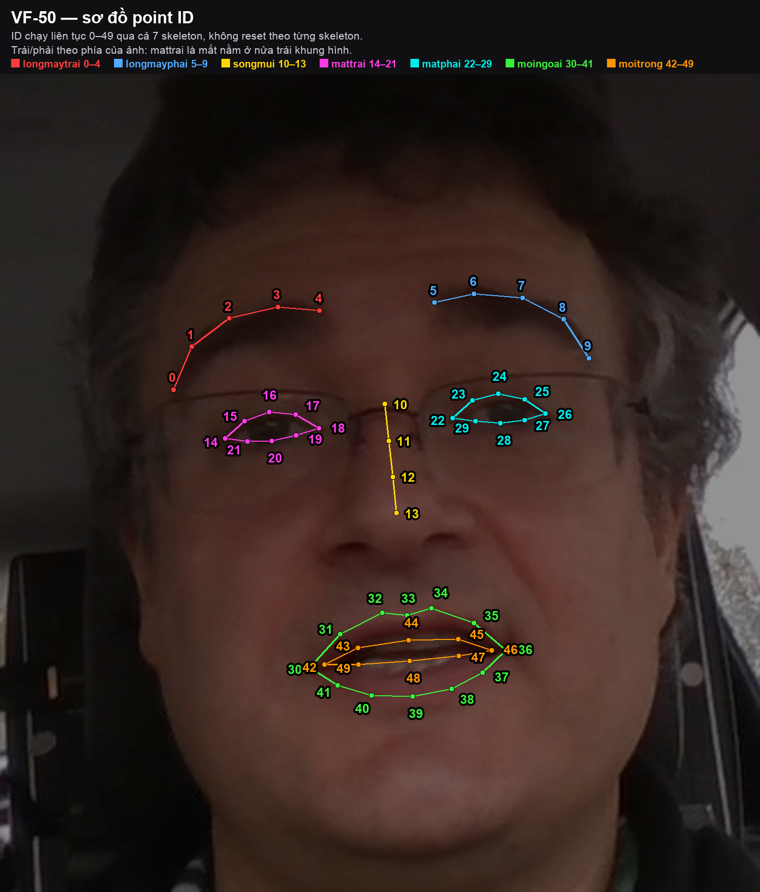
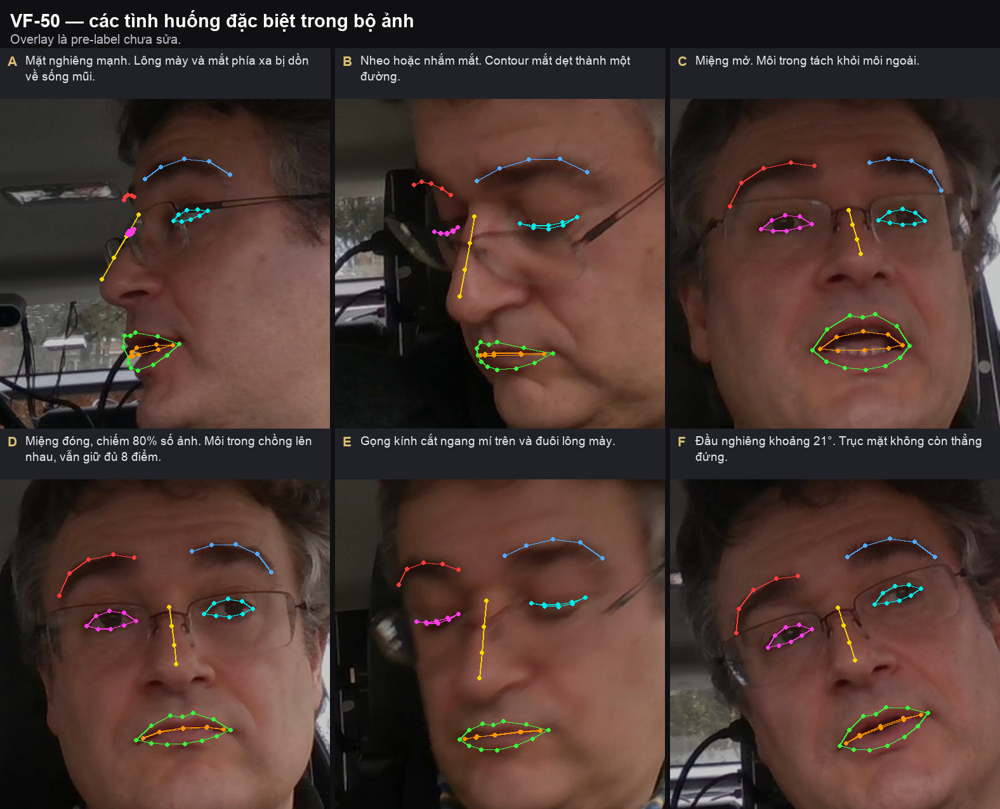

# Guideline gán nhãn — VF-50 Face Landmark

Dành cho học viên. Phiên bản 1.3, Week 2, áp dụng cho 10 nhóm G01–G10.

## 1. Thông tin bài

Đặt 50 điểm landmark lên khuôn mặt người lái, chia thành 7 skeleton.

| **Phần** | **Số ảnh mỗi nhóm** | **Việc phải làm** |
| --- | --- | --- |
| Có pre-label | 50 | Sửa vị trí điểm có sẵn, đặt toàn bộ trạng thái |
| Không pre-label | 20 | Tự dựng schema, đặt cả 50 điểm từ đầu |
| Tổng | 70 |  |

Ảnh 1280 × 720, mỗi ảnh có đúng một khuôn mặt. Toàn bộ ảnh lấy từ một phiên quay liên tục. 50 ảnh có pre-label của mỗi nhóm nằm thành vài dãy frame liên tiếp, xem mục 6.9. 20 ảnh tự làm được rải đều trên cả phiên nên không liên tiếp nhau.

### 1.1. Ba điều cần biết trước khi bắt đầu

**1. Sẽ không thấy khung chữ nhật quanh khuôn mặt, chỉ có 7 nhóm điểm.**

Mở ảnh lên, bạn thấy hai lông mày, sống mũi, hai mắt, môi ngoài và môi trong. Không có khung bao quanh mặt. Bài này không dùng khung đó, nên đừng đi tìm và đừng báo thiếu.

**2. Mọi điểm đang để là "nhìn thấy", kể cả những điểm thật ra đang bị che.**

Máy đặt sẵn cả 50 điểm ở trạng thái Visible cho mọi ảnh. Nói cách khác, phần trạng thái coi như chưa ai làm. Bạn phải xem từng điểm rồi tự chọn Visible, Occluded hay Outside — tính ra 2.500 điểm cho 50 ảnh của nhóm.

Đây là phần tốn thời gian nhất của bài. Làm ngay trong lúc sửa từng ảnh, đừng để dồn đến cuối.

**3. Không có cách nào biết ảnh nào máy làm sai, ngoài việc tự nhìn.**

Máy tự chấm độ tin cậy cho nó ở mức gần như tuyệt đối trên cả 500 ảnh, kể cả những ảnh mà điểm rơi lệch hẳn khỏi khuôn mặt. Nghĩa là không có sẵn danh sách "ảnh cần chú ý". Ảnh nào cũng phải mở ra xem.

### 1.2. Không tự nạp annotation lên task

BTC đã nạp sẵn ảnh và điểm gợi ý vào task của từng nhóm. Bạn chỉ mở task ra làm, không cần và không nên dùng chức năng upload annotation.

Thao tác đó ghi đè toàn bộ dữ liệu đang có trên task, nên mọi thứ nhóm đã sửa sẽ mất. Nếu thấy task trống hoặc thiếu điểm, báo mentor thay vì tự nạp file.

## 2. Quy ước

### 2.1. Trái và phải

Bài này xác định trái/phải theo CÁCH NHÌN TRÊN ẢNH, không theo giải phẫu của người. longmaytrai và mattrai là các vùng nằm về phía trái của khuôn mặt khi quan sát ảnh; longmayphai và matphai nằm về phía phải. Với mặt gần chính diện, các point của nhóm *trai có toạ độ x nhỏ hơn nhóm *phai.

Cách xác định: nhìn trực tiếp bố cục khuôn mặt trên ảnh và giữ thứ tự không gian trái → phải của các nhóm landmark. Không dùng trái/phải giải phẫu của người để đổi tên label. Không chia đôi toàn bộ frame một cách máy móc nếu khuôn mặt lệch khỏi tâm ảnh; tham chiếu là phía trái/phải của KHUÔN MẶT được nhìn thấy trên ảnh.

Khi mặt nghiêng mạnh, vẫn GIỮ NGUYÊN quy ước theo khung hình/khuôn mặt trên ảnh. Không chuyển sang convention giải phẫu giữa chừng. Nếu một vùng bị che đến mức khó xác định, xử lý theo rule Visible/Occluded/Outside hoặc mở Issue; không đổi tên mattrai ↔ matphai để “khớp giải phẫu”.

HumanPose-17 của bộ bài hiện tại cũng đã được chuẩn hoá theo quy ước trái/phải của khung hình VinFast. Vì vậy học viên có thể dùng cùng một nguyên tắc Left/Right xuyên suốt hai bài.

### 2.2. Point ID

ID chạy liên tục 0–49 qua cả 7 skeleton, không reset theo từng skeleton. mattrai dùng 14–21 chứ không phải 0–7.

*Lưu ý: Point ID là chuẩn của bộ dữ liệu hiện tại và phải giữ nguyên khi import/pre-annotation. Không remap theo WFLW, InsightFace, COCO hay một schema face landmark khác.*

| **Skeleton** | **Point ID** | **Số điểm** | **Contour** |
| --- | --- | --- | --- |
| longmaytrai | 0 – 4 | 5 | hở |
| longmayphai | 5 – 9 | 5 | hở |
| songmui | 10 – 13 | 4 | hở |
| mattrai | 14 – 21 | 8 | kín |
| matphai | 22 – 29 | 8 | kín |
| moingoai | 30 – 41 | 12 | kín |
| moitrong | 42 – 49 | 8 | kín |

Tên label viết liền, không dấu, không viết hoa, và không được đổi.

### 2.3. Sơ đồ point ID



In sơ đồ này ra và để cạnh màn hình khi làm việc.

## 3. Định nghĩa điểm

Cột "Tỉ lệ" là vị trí trung vị đo trên 500 ảnh pre-label, dùng để kiểm tra khoảng chia giữa các điểm. 0,00 là điểm đầu chuỗi, 1,00 là điểm cuối chuỗi.

*Các mô tả chi tiết ở Mục 3 được dùng như QUY TẮC VẬN HÀNH cho bộ pre-label hiện tại: chúng tổng hợp topology, hình minh hoạ và thống kê trên dữ liệu. Khi wording ngắn trong guideline nguồn không mô tả đủ từng point, ưu tiên mapping đã được kiểm tra trên pre-label + sơ đồ point ID của bài.*

### 3.1. Lông mày

Mỗi bên gồm 4 điểm trên bờ trên của lông mày và 1 điểm ở đuôi ngoài. Bờ trên là ranh giới giữa lông mày và da trán. Đặt điểm lên mép lông, không đặt vào giữa đám lông và không đặt lên da trán.

longmaytrai chạy từ ngoài vào trong:

| **ID** | **Vị trí giải phẫu** | **Tỉ lệ** |
| --- | --- | --- |
| 0 | Đuôi ngoài, nơi lông mày thon lại về phía thái dương. Điểm này thấp và lệch ra ngoài so với điểm 1 | 0,00 |
| 1 | Bờ trên, đoạn ngoài | 0,15 |
| 2 | Bờ trên, đoạn giữa-ngoài | 0,41 |
| 3 | Bờ trên, đoạn giữa-trong, thường gần đỉnh cung | 0,73 |
| 4 | Đầu trong, gần sống mũi nhất | 1,00 |

longmayphai là ảnh gương, chạy ngược lại từ trong ra ngoài:

| **ID** | **Vị trí giải phẫu** | **Tỉ lệ** |
| --- | --- | --- |
| 5 | Đầu trong, gần sống mũi | 0,00 |
| 6 | Bờ trên, đoạn giữa-trong | 0,26 |
| 7 | Bờ trên, đoạn giữa, thường gần đỉnh cung | 0,58 |
| 8 | Bờ trên, đoạn ngoài | 0,85 |
| 9 | Đuôi ngoài | 1,00 |

Khi mặt gần chính diện, toạ độ x của 10 điểm này tăng dần liên tục từ 0 đến 9. Nếu có điểm phá vỡ thứ tự, kiểm tra lại xem có gán nhầm nhóm hoặc nhầm thứ tự không.

### 3.2. Sống mũi

Bốn điểm chia đều dọc sống mũi. Ba đoạn 10–11, 11–12, 12–13 gần bằng nhau; tỉ lệ đoạn dài nhất trên đoạn ngắn nhất đo được trên pre-label là 1,01.

| **ID** | **Vị trí giải phẫu** | **Tỉ lệ** |
| --- | --- | --- |
| 10 | Đỉnh sống mũi, điểm lõm giữa hai mắt, ngang tầm khoé mắt trong | 0,00 |
| 11 | Một phần ba trên sống mũi | 0,34 |
| 12 | Hai phần ba sống mũi | 0,67 |
| 13 | Chân sống mũi, nơi sống mũi kết thúc và đầu mũi bắt đầu nhô ra | 1,00 |

Điểm 13 không phải đỉnh mũi. Đo trên dữ liệu, điểm 13 nằm ở khoảng 72% quãng đường từ điểm 10 xuống đường nối hai cánh mũi, tức phía trên lỗ mũi và chưa chạm chóp mũi.

### 3.3. Mắt

Contour kín 8 điểm gồm 2 khoé, 3 điểm mí trên và 3 điểm mí dưới. Quy tắc chung cho cả hai mắt: index bắt đầu ở điểm trái nhất của mắt, chạy dọc mí trên sang phải đến điểm phải nhất, rồi vòng về theo mí dưới.

mattrai, điểm trái nhất là khoé ngoài:

| **ID** | **Vị trí giải phẫu** | **Tỉ lệ** |
| --- | --- | --- |
| 14 | Khoé mắt ngoài, phía thái dương | 0,00 |
| 15 | Mí trên, một phần tư ngoài | 0,21 |
| 16 | Mí trên, giữa, điểm cao nhất | 0,48 |
| 17 | Mí trên, một phần tư trong | 0,76 |
| 18 | Khoé mắt trong, phía mũi | 1,00 |
| 19 | Mí dưới, một phần tư trong | 0,76 |
| 20 | Mí dưới, giữa, điểm thấp nhất | 0,50 |
| 21 | Mí dưới, một phần tư ngoài | 0,24 |

matphai, điểm trái nhất là khoé trong:

| **ID** | **Vị trí giải phẫu** | **Tỉ lệ** |
| --- | --- | --- |
| 22 | Khoé mắt trong, phía mũi | 0,00 |
| 23 | Mí trên, một phần tư trong | 0,23 |
| 24 | Mí trên, giữa | 0,51 |
| 25 | Mí trên, một phần tư ngoài | 0,79 |
| 26 | Khoé mắt ngoài, phía thái dương | 1,00 |
| 27 | Mí dưới, một phần tư ngoài | 0,78 |
| 28 | Mí dưới, giữa | 0,52 |
| 29 | Mí dưới, một phần tư trong | 0,25 |

Điểm đặt trên bờ mi, tức ranh giới giữa da mi và nhãn cầu, nơi lông mi mọc ra. Không đặt lên lông mi, không đặt vào lòng trắng.

Bốn điều kiện đúng với mọi mắt, đo được trên toàn bộ 500 ảnh pre-label:

1. Điểm đầu chuỗi, 14 hoặc 22, có toạ độ x nhỏ nhất trong 8 điểm.
2. Điểm khoé còn lại, 18 hoặc 26, có toạ độ x lớn nhất.
3. Mỗi điểm mí trên cao hơn hoặc bằng điểm mí dưới đối diện: 15 với 21, 16 với 20, 17 với 19, và 23 với 29, 24 với 28, 25 với 27.
4. Contour không có đường bắt chéo tạo thành hình chữ X.
### 3.4. Môi

moingoai là contour kín 12 điểm dọc đường viền môi, tức ranh giới giữa phần môi đỏ và vùng da quanh miệng.

| **ID** | **Vị trí giải phẫu** | **Tỉ lệ** |
| --- | --- | --- |
| 30 | Khoé miệng trái | 0,00 |
| 31 – 35 | Bờ môi trên, từ khoé trái sang khoé phải | 0,18 · 0,41 · 0,53 · 0,65 · 0,85 |
| 36 | Khoé miệng phải | 1,00 |
| 37 – 41 | Bờ môi dưới, từ khoé phải về khoé trái | 0,87 · 0,72 · 0,55 · 0,35 · 0,18 |

Điểm 33 và 39 gần chính giữa miệng nhất, dùng làm mốc khi chia khoảng.

moitrong là contour kín 8 điểm dọc mép trong của môi, tức ranh giới môi với khoang miệng.

| **ID** | **Vị trí giải phẫu** | **Tỉ lệ** |
| --- | --- | --- |
| 42 | Khoé trong trái | 0,00 |
| 43 – 45 | Mép trong môi trên | 0,22 · 0,53 · 0,82 |
| 46 | Khoé trong phải | 1,00 |
| 47 – 49 | Mép trong môi dưới | 0,81 · 0,53 · 0,23 |

moitrong luôn nằm hoàn toàn bên trong moingoai: toạ độ x của điểm 42 lớn hơn điểm 30, và điểm 46 nhỏ hơn điểm 36.

## 4. Trạng thái điểm

Ba trạng thái, dùng đúng property có sẵn của CVAT. Không tạo attribute mới. Không dùng Hidden thay cho Outside, vì Hidden chỉ ẩn hiển thị trên giao diện chứ không lưu vào dữ liệu.

| **Trạng thái** | **Cấu hình CVAT** | **Điều kiện** | **Toạ độ** |
| --- | --- | --- | --- |
| Visible | outside = 0, occluded = 0 | Nhìn thấy trực tiếp | Phải đúng |
| Occluded | occluded = 1 | Bị che nhưng còn suy ra được vị trí | Phải đúng theo ước lượng |
| Outside | outside = 1 | Ngoài khung hình, hoặc bị che đến mức không còn căn cứ ước lượng | Không dùng đến |

### 4.1. Quy tắc quyết định cho từng điểm

*Mục tiêu là quyết định trạng thái dựa trên khả năng quan sát/suy luận của landmark thật, không dựa trên confidence của model. Với pre-label sai vị trí, phải sửa geometry trước hoặc đồng thời với trạng thái; không được giữ điểm sai chỉ vì model đã đặt sẵn.*

Áp dụng theo thứ tự:

1. Điểm có nằm trong khung hình không? Không thì Outside.
2. Có nhìn thấy trực tiếp không? Có thì Visible.
3. Có suy ra được vị trí từ hai điểm liền kề trong contour không? Có thì Occluded, không thì Outside.
Không dùng det_confidence hay quality.status để quyết định trạng thái. Hai trường này bằng nhau ở mọi ảnh.

### 4.2. Ngưỡng quyết định cho cả skeleton

*Trong bảng dưới, rule mắt ≥4/8 là rule được nêu rõ trong guideline VF. Các ngưỡng cho lông mày/môi là ngưỡng vận hành của bộ bài hiện tại để thống nhất correction; nếu mentor/BTC ban hành rule mới thì ưu tiên rule mới.*

Áp dụng khi cả một bộ phận bị che, thay vì xét từng điểm:

| **Skeleton** | **Còn nhìn thấy** | **Xử lý** |
| --- | --- | --- |
| mattrai, matphai | Từ 4/8 điểm trở lên | Đặt đủ contour, điểm không thấy đánh Occluded |
| mattrai, matphai | Dưới 4/8 điểm | Outside cả skeleton |
| longmaytrai, longmayphai | Từ 3/5 điểm trở lên | Đặt đủ, điểm không thấy đánh Occluded |
| longmaytrai, longmayphai | Dưới 3/5 điểm | Outside cả skeleton |
| moingoai | Từ 6/12 điểm trở lên | Đặt đủ |
| moitrong | Từ 4/8 điểm trở lên | Đặt đủ |
| songmui | Chỉ Outside khi cả sống mũi khuất |  |

## 5. Quy trình

Bài chia làm hai phần và cách làm khác nhau:

| **Phần** | **Số ảnh** | **Label schema** | **Điểm landmark** |
| --- | --- | --- | --- |
| A | 50 | BTC cấu hình sẵn trong task | Đã có sẵn trên task, chỉ sửa |
| B | 20 | Nhóm **tự dựng** | Nhóm **tự vẽ từ đầu** |

### 5.1. Phần A — 50 ảnh có pre-label

1. Mở đúng task được phân công, đối chiếu mã nhóm. Ảnh và điểm gợi ý đã có sẵn.
2. Chạy kiểm tra ở mục 5.2 trên 5 ảnh đầu. Nếu có mục nào không đạt thì dừng và báo mentor, chưa sửa hàng loạt.
3. Sửa từng ảnh theo thứ tự ở mục 5.5.
4. Tự kiểm tra theo mục 7 rồi nộp.
### 5.2. Kiểm tra 5 ảnh đầu trước khi làm hàng loạt

Mở 5 ảnh đầu của task và soát:

- Có đủ 7 skeleton trên mỗi frame.
- Không có label Face, đúng như thiết kế.
- Hai mắt tạo thành vòng kín, không có đường bắt chéo.
- mattrai nằm ở nửa trái khung hình.
- Toạ độ x của các điểm 0 đến 9 tăng dần.
- moitrong nằm trong moingoai.
- Không có điểm nào rơi ra ngoài khuôn mặt.
### 5.3. Phần B — đối chiếu label schema

Schema 7 skeleton đã dựng sẵn ở project của nhóm và dùng chung cho cả bốn task. Việc của nhóm ở phần B là đối chiếu schema đó với đặc tả trước khi vẽ, không phải dựng lại.

Cả bốn task dùng chung một bộ Labels ở cấp project nên không ai được sửa; sửa một sublabel là đổi luôn cho phần A. Phân công **một người đối chiếu**, báo cả nhóm kết quả rồi mới bắt đầu vẽ.

Đối chiếu xong báo mentor trước khi vẽ hàng loạt. Thấy sai thì báo, tuyệt đối không tự đổi tên sublabel: đổi sau khi đã vẽ sẽ làm mất annotation đã có.

**Cách 1 — xem trong phần Labels của project.** Làm lần lượt cho từng skeleton trong bảng ở mục 2.2:

1. Mở Labels của project, tìm label đúng tên như bảng, xác nhận kiểu là Skeleton.
2. Xem các node trên khung vẽ có đúng hình dạng thật của bộ phận không, tham chiếu sơ đồ ở mục 2.3.
3. Soát các cạnh nối giữa các node theo đúng thứ tự point ID.
4. Soát tên từng sublabel là **point ID toàn cục** dạng chuỗi số: mattrai có sublabel tên 14 đến 21, không phải 0 đến 7.
5. Xong skeleton này thì sang skeleton sau.
Số node và số cạnh phải khớp bảng này:

| **Skeleton** | **Sublabel** | **Số node** | **Số cạnh** | **Nối** |
| --- | --- | --- | --- | --- |
| longmaytrai | 0 … 4 | 5 | 4 | 0-1-2-3-4, hở hai đầu |
| longmayphai | 5 … 9 | 5 | 4 | 5-6-7-8-9, hở hai đầu |
| songmui | 10 … 13 | 4 | 3 | 10-11-12-13, hở hai đầu |
| mattrai | 14 … 21 | 8 | 8 | 14→21 rồi 21 nối về 14, vòng kín |
| matphai | 22 … 29 | 8 | 8 | 22→29 rồi 29 nối về 22, vòng kín |
| moingoai | 30 … 41 | 12 | 12 | 30→41 rồi 41 nối về 30, vòng kín |
| moitrong | 42 … 49 | 8 | 8 | 42→49 rồi 49 nối về 42, vòng kín |

Tổng 50 node và 47 cạnh trên 7 skeleton.

**Cách 2 — mở tab Raw để đọc JSON.** Những điểm CVAT bắt buộc, dùng để soi lại cả 7 skeleton:

- Mỗi label có "type": "skeleton" và "attributes": [].
- Mỗi sublabel có "type": "points" và "attributes": [].
- Có trường "svg" hợp lệ, trong đó mỗi node là một thẻ circle mang data-label-name trùng tên sublabel, mỗi cạnh là một thẻ line mang data-node-from và data-node-to.
Không thêm occluded hay outside vào Raw để tạo dropdown. Hai trường này là trạng thái của annotation, không phải attribute của ontology.

Schema đối chiếu nằm ở mục 10. Dùng nó để so với schema đang có trong project; chỉ mentor mới được sửa.

**Đối chiếu đủ các mục sau:**

- Đủ 7 label, tên viết đúng tuyệt đối, không có label Face.
- Tổng 50 sublabel, tên là số từ 0 đến 49, không trùng, không thiếu.
- Bốn skeleton mattrai, matphai, moingoai, moitrong là vòng kín; ba skeleton còn lại hở hai đầu.
- Thử đặt một skeleton lên ảnh bất kỳ, xem hình dạng mẫu có giống bộ phận thật không.
Hai lỗi schema hay gặp, thấy thì báo mentor:

| **Thông báo** | **Nguyên nhân** | **Cách sửa** |
| --- | --- | --- |
| attributes must be an array | Thiếu "attributes": [] ở label hoặc sublabel | Thêm vào cả hai cấp |
| skeletons must provide a correct SVG template | Thiếu svg, hoặc node trong svg không khớp tên sublabel | Dựng lại node và cạnh, đối chiếu tên sublabel |

### 5.4. Phần B — vẽ từ đầu

1. Chọn công cụ Skeleton và label cần vẽ.
2. Đặt điểm theo thứ tự point ID, tuân thủ mục 5.5.
3. Đặt trạng thái cho từng điểm.
4. Lưu trước khi sang ảnh tiếp theo.
Không vẽ bounding box Face, schema của bài không dùng.

Sau khi làm xong 2 ảnh đầu, đối chiếu với phần A để thống nhất cách đặt điểm giữa hai nửa dataset.

### 5.5. Thứ tự đặt điểm trong một ảnh

Dùng chung cho cả phần A và phần B:

1. Kiểm tra trái phải. Sai thì sửa ngay, trước khi tinh chỉnh vị trí.
2. Đặt 12 điểm neo: 0, 4, 5, 9, 10, 13, 14, 18, 22, 26, 30, 36. Các điểm này quyết định phần còn lại.
3. Đặt các điểm contour giữa các neo, giữ khoảng chia theo tỉ lệ ở mục 3.
4. Đặt trạng thái cho từng điểm.
5. Lưu trước khi sang ảnh tiếp theo.
Zoom tối thiểu 200% khi đặt điểm mắt và môi trong. Ở mức 100%, 8 điểm của một mắt nằm gọn trong khoảng 25 px và không thể đặt chính xác.

## 6. Tình huống đặc biệt



### 6.1. Mặt nghiêng mạnh

Khi mặt quay nhiều, lông mày và mắt phía xa bị sống mũi và gò má che. Pre-label thường dồn cả cụm điểm về giữa mặt, cách vị trí thật khá xa. Trường hợp nghiêng nhất trong bộ có khoảng cách hai mắt tụt từ khoảng 96 px xuống 56 px.

Xử lý theo ngưỡng ở mục 4.2. Không giữ nguyên cụm điểm bị dồn rồi đánh Occluded, vì Occluded vẫn đòi toạ độ ước lượng đúng.

### 6.2. Nheo hoặc nhắm mắt

Contour vẫn giữ đủ 8 điểm và vẫn là vòng kín. Mí trên và mí dưới trùng nhau theo đường khe mí, nên các cặp 15 với 21, 16 với 20, 17 với 19 được phép cùng toạ độ y. Hai khoé mắt vẫn đặt đúng vị trí giải phẫu, không kéo sát vào nhau. Trạng thái là Visible nếu còn thấy đường khe mí, chỉ Occluded khi bị vật khác che.

### 6.3. Miệng mở

Khoảng 20% số ảnh có miệng hé hoặc mở. moitrong tách rõ khỏi moingoai và ôm theo khoang miệng thật. Nếu thấy răng hoặc lưỡi, đặt điểm lên mép môi chứ không lên răng. Làm điểm 44 và 48 trước rồi chia phần còn lại.

### 6.4. Miệng đóng

Chiếm 399 trong 500 ảnh, tức 80%, nên đây là trường hợp mặc định chứ không phải ngoại lệ.

moitrong vẫn giữ đủ 8 điểm, nằm dọc theo đường khép môi. Các cặp trên dưới đối diện, 43 với 49, 44 với 48, 45 với 47, được phép trùng hoặc gần trùng toạ độ. Trên pre-label, thứ tự trên dưới của moitrong chỉ giữ đúng ở 40% ảnh, phần còn lại là do môi khép nên hai đường chồng lên nhau.

Không xoá skeleton moitrong và không đặt Outside chỉ vì miệng đóng. Vẫn giữ ràng buộc moitrong nằm trong moingoai.

### 6.5. Kính

Người trong ảnh đeo kính ở gần như toàn bộ frame.

| **Tình huống** | **Xử lý** |
| --- | --- |
| Gọng cắt ngang mí trên nhưng vẫn thấy bờ mi hai bên | Đặt điểm lên bờ mi phía sau gọng, đánh Occluded |
| Gọng che hẳn đuôi lông mày | Ước lượng theo hướng đi của lông mày, đánh Occluded |
| Phản quang che kín vùng mắt, còn khoé mắt nhìn được | Ước lượng từ khoé mắt, đánh Occluded |
| Phản quang che kín, không còn khoé mắt nào nhìn được | Outside cả skeleton mắt |

Không đặt điểm lên gọng kính trong mọi trường hợp.

### 6.6. Đầu nghiêng

Góc nghiêng của đường nối hai mắt trong bộ ảnh dao động từ −21° đến +5°. Khi mặt nghiêng, trên dưới theo khung hình không còn khớp với trên dưới của khuôn mặt, dễ đảo mí trên với mí dưới.

Xác định mí trên và mí dưới theo giải phẫu khuôn mặt. Quy ước trái phải vẫn giữ theo khung hình như mục 2.1.

### 6.7. Tay, vô-lăng, dây an toàn che mặt

Xử lý như mục 6.1: che một phần thì Occluded kèm toạ độ ước lượng, che hoàn toàn một bộ phận thì Outside cả skeleton đó.

### 6.8. Ảnh nhoè

Đặt điểm ở tâm vệt nhoè. Nếu nhoè đến mức không phân biệt được mắt với lông mày, mở Issue và bỏ qua frame thay vì đoán.

### 6.9. Frame liên tiếp giống nhau

Mục này áp dụng cho 50 ảnh có pre-label: mỗi nhóm nhận 2 đến 3 dãy frame liên tiếp. 20 ảnh của phần B rải đều trên cả phiên, không liên tiếp nhau.

Không copy nguyên nhãn của frame trước mà không kiểm tra, vì điểm sẽ trôi dần khỏi vị trí đúng. Ngược lại, nhãn giữa hai frame liền kề phải mượt. Trên pre-label, độ dịch chuyển trung bình giữa hai frame liền kề là 2,7 px và phân vị 90 là 7,7 px. Nếu nhãn nhảy quá 15 px giữa hai frame liền kề mà trong ảnh không có chuyển động tương ứng, kiểm tra lại cả hai frame.

### 6.10. Mặt nhỏ hoặc ở rìa khung hình

Khoảng cách hai mắt nhỏ nhất trong bộ là 56 px, mức này cần zoom từ 300% trở lên. Điểm rơi ra ngoài biên ảnh đánh Outside.

### 6.11. Không có mặt hoặc có nhiều hơn một mặt

500 ảnh có pre-label đều có đúng một khuôn mặt. Nếu ở 20 ảnh tự làm gặp ảnh không có mặt, hoặc có mặt thứ hai như hành khách hay ảnh phản chiếu trong gương, mở Issue. Mặc định chỉ gán nhãn người lái.

### 6.12. Pre-label đã đúng

Nếu kiểm tra thấy hình học đúng thì giữ nguyên vị trí, nhưng vẫn phải đặt trạng thái cho cả 50 điểm. Giữ nguyên là một kết quả hợp lệ.

## 7. Tự kiểm tra trước khi nộp

### 7.1. Từng frame

- Đủ 7 skeleton và 50 điểm.
- mattrai và longmaytrai ở nửa trái khung hình.
- Toạ độ x của các điểm 0 đến 9 tăng dần khi mặt gần chính diện.
- Hai mắt là vòng kín, không bắt chéo.
- Mí trên cao hơn hoặc bằng mí dưới ở cả ba cặp đối diện của mỗi mắt.
- Điểm 13 nằm trên lỗ mũi, chưa chạm chóp mũi.
- Ba đoạn của songmui chia gần đều.
- moitrong nằm trong moingoai.
- Không có điểm nào nằm trên gọng kính, tóc hoặc nền phía sau.
- Mọi điểm đã có trạng thái.
- Điểm Occluded có toạ độ ước lượng hợp lý, không giữ nguyên vị trí sai của pre-label.
### 7.2. Cả job

- Đã làm đủ 70 ảnh.
- Đã đối chiếu schema ở phần B: đúng 7 label, 50 sublabel, tên trùng khít với phần A.
- Đã rà lại ít nhất 10 frame, trong đó có 1 frame nghiêng mạnh, 1 frame miệng mở, 1 frame nheo mắt, 1 frame kính loá.
- Đã lướt toàn bộ job theo thứ tự frame để phát hiện điểm nhảy bất thường.
- Mọi trường hợp không chắc đã mở Issue thay vì tự đặt luật mới.
## 8. Sai số cho phép

Chuẩn hoá theo IOD, tức khoảng cách giữa tâm hai mắt, trung vị khoảng 96 px trong bộ ảnh này.

| **Nhóm điểm** | **Ngưỡng** | **Quy ra px** |
| --- | --- | --- |
| 12 điểm neo: 0, 4, 5, 9, 10, 13, 14, 18, 22, 26, 30, 36 | 3% IOD | khoảng 3 px |
| Các điểm contour còn lại | 5% IOD | khoảng 5 px |
| Sai số trung bình toàn ảnh (NME) | 0,035 | khoảng 3,4 px |

Các ngưỡng này là đề xuất khởi điểm, sẽ được chốt lại sau khi mentor hoàn thành bộ ảnh chuẩn.

## 9. Lỗi thường gặp

| **Lỗi** | **Nguyên nhân** | **Xử lý** |
| --- | --- | --- |
| Đi tìm label Face không thấy | Tài liệu cũ mô tả sai | Schema không có Face, xem mục 1.1 |
| Đảo trái phải toàn bộ job | Dùng convention giải phẫu hoặc đổi convention khi mặt nghiêng | Giữ Left/Right theo khung hình/khuôn mặt trên ảnh, xem mục 2.1 |
| Mắt thành hình chữ X | Sai thứ tự nối điểm | Kiểm tra thứ tự 14→21 và 22→29 |
| Đặt điểm 13 ở chóp mũi | Không có định nghĩa trong tài liệu cũ | Điểm 13 là chân sống mũi, xem mục 3.2 |
| Xoá moitrong khi miệng đóng | Tưởng là lỗi | Miệng đóng chiếm 80% số ảnh, xem mục 6.4 |
| Đặt điểm lên gọng kính | Gọng dễ nhìn hơn bờ mi | Luôn đặt lên bờ mi thật rồi đánh Occluded, xem mục 6.5 |
| Quên đặt trạng thái | Pre-label đã gán visible sẵn nên trông như đã xong | Phải đặt mới toàn bộ, xem mục 1.1 |
| Reset point ID theo từng skeleton | Hiểu nhầm về skeleton | ID toàn cục 0–49, xem mục 2.2 |
| Tự nạp annotation rồi mất hết công | Upload ghi đè dữ liệu trên task | Không dùng upload annotation, xem mục 1.2 |
| Copy nhãn giữa các frame liên tiếp | Ảnh gần giống nhau | Xem mục 6.9 |
| Schema phần B đặt sublabel là 0–7 cho mỗi skeleton | Reset ID theo từng skeleton | Dùng point ID toàn cục, xem mục 5.3 |
| Hai người cùng sửa Labels, schema bị ghi đè | Không phân công ai dựng | Một người dựng, cả nhóm kiểm tra, xem mục 5.3 |
| Chia đôi toàn bộ frame để xác định trái/phải | Khuôn mặt có thể lệch khỏi tâm ảnh | Xác định trái/phải theo bố cục của khuôn mặt trên ảnh, không theo tâm frame |

*Ghi chú nguồn: guideline học viên giữ các mô tả chi tiết/threshold hữu ích từ bản cũ, nhưng đã sửa toàn bộ convention Left/Right để đồng bộ VinFast theo khung hình và giữ nguyên thiết kế hiện tại KHÔNG có Face bbox.*

## 10. Phụ lục — schema đối chiếu

Dùng để kiểm tra lại schema tự dựng ở mục 5.3. Chỉ dán thẳng vào tab Raw khi mentor cho phép.

File: schema/vf50_labels_raw.json

Cấu trúc rút gọn, phần svg lược bớt cho dễ đọc:

```json
[
  {
    "name": "longmaytrai",
    "type": "skeleton",
    "attributes": [],
    "sublabels": [
      { "name": "0", "type": "points", "attributes": [] },
      { "name": "1", "type": "points", "attributes": [] },
      { "name": "2", "type": "points", "attributes": [] },
      { "name": "3", "type": "points", "attributes": [] },
      { "name": "4", "type": "points", "attributes": [] }
    ],
    "svg": "<line ... data-type=\"edge\" data-node-from=\"1\" data-node-to=\"2\"></line> ... <circle ... data-type=\"element node\" data-element-id=\"1\" data-node-id=\"1\" data-label-name=\"0\"></circle> ..."
  }
]
```

Sáu skeleton còn lại theo đúng khuôn này, chỉ khác tên label và dải tên sublabel.

Ba quy tắc rút ra từ schema, dùng để tự kiểm tra:

1. data-label-name của mỗi circle phải trùng tên một sublabel, và thứ tự các circle trùng thứ tự sublabel.
2. data-node-id chạy liên tục từ 1 đến số điểm của skeleton đó. Đây là số thứ tự trong skeleton, khác với tên sublabel vốn là point ID toàn cục.
3. data-node-from và data-node-to của mỗi line chỉ nhận giá trị trong dải data-node-id nói trên.
