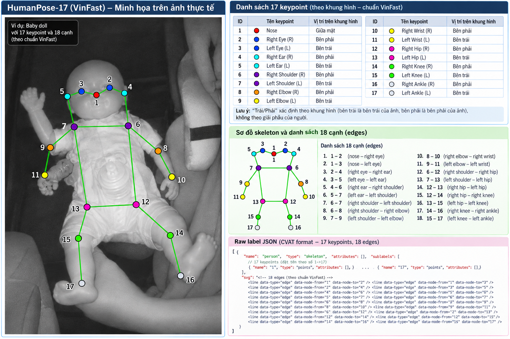
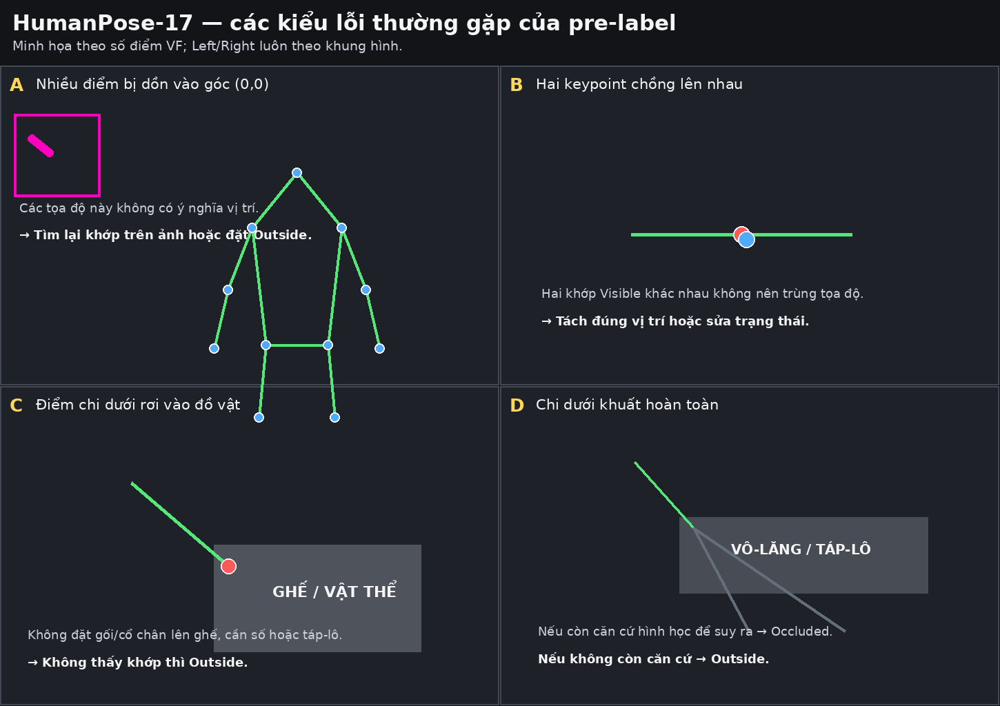

# Guideline gán nhãn — HumanPose-17 Body Keypoints

Dành cho học viên. Phiên bản 1.1, Week 2, áp dụng cho 10 nhóm G01–G10. Cập nhật quy ước Left/Right theo khung hình VinFast.

## 1. Thông tin bài

Đặt 17 keypoint lên cơ thể người lái trong cabin xe, dưới dạng một skeleton tên person.

| **Phần** | **Số ảnh mỗi nhóm** | **Việc phải làm** |
| --- | --- | --- |
| Có pre-label | 40 | Sửa vị trí điểm có sẵn, đặt trạng thái |
| Không pre-label | 20 | Tự dựng schema, đặt cả 17 điểm từ đầu |
| Tổng | 60 |  |

Ảnh 960 × 540. Dữ liệu trải trên 15 người lái và 29 đoạn quay khác nhau.

### 1.1. Bốn điều cần biết trước khi bắt đầu

**1. Ảnh bị xoay 90°.**

Người lái nằm ngang trong ảnh: đầu ở bên trái, chân ở bên phải. Nghĩa là "phía trên" của ảnh không phải "phía trên" của cơ thể. Mỗi lần mở một ảnh mới, nhìn xác định đâu là đầu đâu là chân trước rồi mới đặt điểm.

**2. Sẽ thấy một chùm điểm chồng lên nhau ở góc trên-trái ảnh.**

Đó là những khớp máy không đoán được nên vứt tạm vào góc. Toạ độ đó vô nghĩa, không phải vị trí thật của khớp. Có ở 68% số ảnh.

Với mỗi điểm như vậy, bạn nhìn ảnh, tự tìm xem khớp đó ở đâu, rồi kéo về đúng chỗ hoặc đánh Outside nếu không thấy. Không kéo đại cho gần gần. Chi tiết ở mục 6.1.

**3. Máy sai nhiều nhất ở chân và tai.**

Trong 400 ảnh có điểm gợi ý: điểm 4 (R Ear) hỏng 220 lần, điểm 16 (R Ankle) 118 lần, điểm 17 (L Ankle) 82 lần. Những chỗ này coi như làm lại từ đầu, đừng mất công chỉnh nhẹ vài pixel.

**4. Chỉ gán nhãn người lái.**

Một số ảnh có hành khách hoặc người ngồi ghế sau lọt vào khung. Bỏ qua họ, trừ khi mentor nói khác.

### 1.2. Không tự nạp annotation lên task

BTC đã nạp sẵn ảnh và điểm gợi ý vào task của từng nhóm. Bạn chỉ mở task ra làm, không cần và không nên dùng chức năng upload annotation.

Thao tác đó ghi đè toàn bộ dữ liệu đang có trên task, nên mọi thứ nhóm đã sửa sẽ mất. Nếu thấy task trống hoặc thiếu điểm, báo mentor thay vì tự nạp file.

## 2. Quy ước

### 2.1. Trái và phải

Bài này xác định trái/phải theo KHUNG HÌNH, theo đúng quy ước VinFast. Điểm R nằm ở phía phải của ảnh đang hiển thị; điểm L nằm ở phía trái của ảnh. Không suy luận theo tay/chân giải phẫu của người lái.

Cách xác định, làm đúng thứ tự:

1. Nhìn trực tiếp khung ảnh đang hiển thị trên CVAT.
2. Xác định nửa trái và nửa phải của khung hình, bất kể người lái quay mặt, quay lưng hay ảnh bị xoay 90°.
3. Gán các điểm R_* ở phía phải khung hình và các điểm L_* ở phía trái khung hình theo đúng số thứ tự VF.
Mẹo kiểm tra nhanh: với một người nhìn thẳng, các điểm chẵn 2, 4, 6, 8, 10, 12, 14, 16 nằm về phía phải khung hình; các điểm lẻ tương ứng 3, 5, 7, 9, 11, 13, 15, 17 nằm về phía trái khung hình. Đây chỉ là kiểm tra topology, không thay cho việc đặt đúng khớp thực tế.

Bài VF-50 Face Landmark của cùng tuần cũng dùng quy ước trái/phải theo phía của khung hình. Vì vậy hai bài HumanPose-17 và Face Landmark dùng cùng một quy ước Left/Right.

### 2.2. Danh sách keypoint

Thứ tự điểm không được đổi. Trên CVAT, sublabel dùng số 1 đến 17 để khớp trực tiếp với guideline VinFast và Raw schema của bài.

| **Index** | **Tên** | **Index** | **Tên** |
| --- | --- | --- | --- |
| 1 | Nose | 10 | R Wrist |
| 2 | R Eye | 11 | L Wrist |
| 3 | L Eye | 12 | R Hip |
| 4 | R Ear | 13 | L Hip |
| 5 | L Ear | 14 | R Knee |
| 6 | R Shoulder | 15 | L Knee |
| 7 | L Shoulder | 16 | R Ankle |
| 8 | R Elbow | 17 | L Ankle |
| 9 | L Elbow |  |  |

### 2.3. Sơ đồ keypoint



In sơ đồ này ra và để cạnh màn hình khi làm việc.

## 3. Định nghĩa điểm

Nguyên tắc chung: điểm đánh dấu khớp và đặt ở tâm khớp, không đặt lên quần áo hay mép ngoài chi.

### 3.1. Vùng đầu

| **#** | **Tên** | Vị trí theo guideline VF |
| --- | --- | --- |
| 1 | Nose | Chóp mũi. Mặt nghiêng vẫn là chóp mũi, không dời về giữa mặt. |
| 2 | R Eye | Tâm đồng tử của mắt nằm phía PHẢI khung hình. Mắt nhắm thì đặt ở tâm khe mí. |
| 3 | L Eye | Tâm đồng tử của mắt nằm phía TRÁI khung hình. Mắt nhắm thì đặt ở tâm khe mí. |
| 4 | R Ear | Ống tai nằm phía PHẢI khung hình, không phải chóp vành tai hay dái tai. |
| 5 | L Ear | Ống tai nằm phía TRÁI khung hình, không phải chóp vành tai hay dái tai. |

Khi tóc phủ kín tai, nếu còn ước lượng được vị trí ống tai từ đường viền hàm và thái dương thì đặt điểm rồi đánh Occluded, không thì Outside. R/L của tai vẫn xác định theo phía khung hình.

### 3.2. Chi trên

| **#** | **Tên** | Vị trí theo guideline VF |
| --- | --- | --- |
| 6 | R Shoulder | Tâm khớp vai nằm phía PHẢI khung hình, tại điểm xoay của cánh tay. |
| 7 | L Shoulder | Tâm khớp vai nằm phía TRÁI khung hình. |
| 8 | R Elbow | Tâm khớp khuỷu nằm phía PHẢI khung hình. |
| 9 | L Elbow | Tâm khớp khuỷu nằm phía TRÁI khung hình. |
| 10 | R Wrist | Tâm khớp cổ tay nằm phía PHẢI khung hình, ở nếp gấp cổ tay. |
| 11 | L Wrist | Tâm khớp cổ tay nằm phía TRÁI khung hình. |

Tay đặt trên vô-lăng là tư thế thường gặp nhất của bài. Cổ tay vẫn đặt ở nếp gấp cổ tay, không dời lên vành vô-lăng. R/L xác định theo phía khung hình, không theo tay giải phẫu của người lái.

### 3.3. Chi dưới

Đây là vùng pre-label sai nhiều nhất, vì trong cabin chi dưới thường khuất sau vô-lăng, bảng táp-lô, ghế, hoặc nằm ngoài khung hình.

| **#** | **Tên** | Vị trí theo guideline VF |
| --- | --- | --- |
| 12 | R Hip | Tâm khớp háng nằm phía PHẢI khung hình, không phải mép ngoài hông hay cạp quần. |
| 13 | L Hip | Tâm khớp háng nằm phía TRÁI khung hình. |
| 14 | R Knee | Tâm khớp gối nằm phía PHẢI khung hình, giữa xương bánh chè. |
| 15 | L Knee | Tâm khớp gối nằm phía TRÁI khung hình. |
| 16 | R Ankle | Tâm khớp cổ chân nằm phía PHẢI khung hình, ngang mắt cá. |
| 17 | L Ankle | Tâm khớp cổ chân nằm phía TRÁI khung hình. |

Cách quyết định khi chi dưới bị che:

| **Nhìn thấy được gì** | **Xử lý cho gối và cổ chân** |
| --- | --- |
| Thấy đường đùi hoặc cẳng chân qua quần | Occluded, ước lượng theo trục chi |
| Chỉ thấy hông, chi dưới khuất hẳn | Outside |
| Chi dưới bị khung hình cắt | Outside |

Không đặt điểm lên ghế, cần số hay sàn xe chỉ vì cần chỗ để đặt. Không ước lượng vị trí gối và cổ chân chỉ dựa vào tỉ lệ cơ thể khi không thấy bất cứ phần nào của chi.

## 4. Trạng thái điểm

Ba trạng thái, dùng đúng property có sẵn của CVAT. Không tạo attribute mới. Không dùng Hidden thay cho Outside, vì Hidden chỉ ẩn hiển thị trên giao diện chứ không lưu vào dữ liệu.

| **Trạng thái** | **Cấu hình CVAT** | **Điều kiện** | **Toạ độ** |
| --- | --- | --- | --- |
| Visible | outside = 0, occluded = 0 | Nhìn thấy trực tiếp khớp | Phải đúng |
| Occluded | occluded = 1 | Bị che nhưng còn suy ra được vị trí | Phải đúng theo ước lượng |
| Outside | outside = 1 | Ngoài khung hình, hoặc bị che đến mức không còn căn cứ ước lượng | Không dùng đến |

### 4.1. Quy tắc quyết định

Áp dụng theo thứ tự:

1. Khớp có nằm trong khung hình không? Không thì Outside.
2. Có nhìn thấy trực tiếp không? Có thì Visible.
3. Có suy ra được vị trí từ các khớp liền kề, tư thế và tỉ lệ cơ thể không? Có thì Occluded và đặt điểm ở vị trí ước lượng, không thì Outside.
Không dùng confidence để quyết định trạng thái. Confidence thấp có thể do che khuất, do ra ngoài khung, do nhoè, hoặc do mô hình đoán sai.

Khi không chắc, chọn Outside. Một điểm Outside trung thực tốt hơn một điểm Occluded đặt sai cả trăm pixel.

## 5. Quy trình

Bài chia làm hai phần và cách làm khác nhau:

| **Phần** | **Số ảnh** | **Label schema** | **Keypoint** |
| --- | --- | --- | --- |
| A | 40 | BTC cấu hình sẵn trong task | Đã có sẵn trên task, chỉ sửa |
| B | 20 | Nhóm **tự dựng** | Nhóm **tự vẽ từ đầu** |

### 5.1. Phần A — 40 ảnh có pre-label

1. Mở đúng task được phân công, đối chiếu mã nhóm. Ảnh và điểm gợi ý đã có sẵn.
2. Chạy kiểm tra ở mục 5.2 trên 5 ảnh đầu. Nếu có mục nào không đạt thì dừng và báo mentor.
3. Sửa từng ảnh theo thứ tự ở mục 5.5.
4. Tự kiểm tra theo mục 7 rồi nộp.
### 5.2. Kiểm tra 5 ảnh đầu trước khi làm hàng loạt

- Có skeleton person với đủ 17 sublabel, được đánh số 1 đến 17.
- Số skeleton khớp số người cần gán, mặc định là một người lái.
- Không có skeleton nào lệch toàn bộ so với người trong ảnh.
- Đã nhận ra chùm điểm ở góc trên-trái.
- Trái/phải chưa bị đảo: R ở phía phải khung hình, L ở phía trái khung hình.
### 5.3. Phần B — đối chiếu label schema

Schema đã dựng sẵn ở project của nhóm và dùng chung cho cả bốn task. Đó là skeleton person; việc của nhóm ở phần B là đối chiếu schema đó với đặc tả trước khi vẽ, không phải dựng lại.

Cả bốn task dùng chung một bộ Labels ở cấp project nên không ai được sửa; sửa một sublabel là đổi luôn cho phần A. Phân công **một người đối chiếu**, báo cả nhóm kết quả rồi mới bắt đầu vẽ.

Đối chiếu xong báo mentor trước khi vẽ hàng loạt. Thấy sai thì báo, tuyệt đối không tự đổi tên sublabel: đổi sau khi đã vẽ sẽ làm mất annotation đã có.

**Cách 1 — xem trong phần Labels của project:**

1. Mở Labels của project, tìm label tên person, xác nhận kiểu là Skeleton.
2. Xem 17 node trên khung vẽ có đúng dáng người đứng nhìn thẳng không, tham chiếu sơ đồ ở mục 2.3.
3. Soát 17 cạnh theo bảng dưới.
4. Soát tên từng sublabel là số 1, 2, …, 17 đúng như danh sách ở mục 2.2. Không dùng L_* / R_* trong schema của bài này.
5. Lưu.
Các cạnh cần nối theo topology VF:

| **Vùng** | **Cạnh** |
| --- | --- |
| Đầu | 1–2, 1–3, 2–4, 3–5, (đầu - thân): 4-6, 5-7 |
| Thân | 6–7, 6–12, 7–13, 12–13 |
| Tay | 6–8, 8–10, 7–9, 9–11 |
| Chân | 12–14, 14–16, 13–15, 15–17 |

Khi soát node, nhớ rằng R/L theo khung hình. Với dáng người nhìn thẳng trong trình vẽ, các node R (2,4,6,8,10,12,14,16) nằm ở nửa phải; các node L (3,5,7,9,11,13,15,17) nằm ở nửa trái.

**Cách 2 — mở tab Raw để đọc JSON.** Những điểm CVAT bắt buộc, dùng để soi lại schema:

- Label có "type": "skeleton" và "attributes": [].
- Mỗi sublabel có "type": "points" và "attributes": [].
- Có trường "svg" hợp lệ, trong đó mỗi node là một thẻ circle mang data-label-name trùng đúng số sublabel ("1"…"17"), mỗi cạnh là một thẻ line mang data-node-from và data-node-to.
Không thêm occluded hay outside vào Raw để tạo dropdown. Hai trường này là trạng thái của annotation, không phải attribute của ontology.

Schema đối chiếu nằm ở mục 10. Dùng nó để so với schema đang có trong project; chỉ mentor mới được sửa.

**Đối chiếu đủ các mục sau:**

- Một label person, đủ 17 sublabel từ 1 đến 17, không thừa không thiếu.
- Thứ tự sublabel đúng như mục 2.2.
- Đủ các cạnh theo bảng topology; mỗi tay và mỗi chân tạo thành chuỗi liền mạch.
- Thử đặt một skeleton lên ảnh bất kỳ, xem hình dạng mẫu có giống dáng người không.
Hai lỗi schema hay gặp, thấy thì báo mentor:

| **Thông báo** | **Nguyên nhân** | **Cách sửa** |
| --- | --- | --- |
| attributes must be an array | Thiếu "attributes": [] ở label hoặc sublabel | Thêm vào cả hai cấp |
| skeletons must provide a correct SVG template | Thiếu svg, hoặc node trong svg không khớp tên sublabel | Dựng lại node và cạnh, đối chiếu tên sublabel |

### 5.4. Phần B — vẽ từ đầu

1. Xác định phía trái/phải của KHUNG HÌNH trước khi đặt điểm đầu tiên. Không cần suy luận trái/phải giải phẫu của người lái.
2. Chọn công cụ Skeleton và label person.
3. Đặt điểm theo thứ tự ở mục 5.5.
4. Đặt trạng thái cho cả 17 điểm.
5. Lưu trước khi sang ảnh tiếp theo.
Zoom từ 200% trở lên cho vùng đầu, vì khoảng cách hai mắt trong bộ này có lúc chỉ 9 px.

Sau khi làm xong 2 ảnh đầu, đối chiếu với phần A để thống nhất cách đặt điểm giữa hai nửa dataset.

### 5.5. Thứ tự đặt điểm trong một ảnh

Dùng chung cho cả phần A và phần B:

1. Kiểm tra trái/phải theo khung hình: R ở bên phải ảnh, L ở bên trái ảnh.
2. Chỉ ở phần A: xử lý các điểm ở góc (0, 0), quyết định từng điểm theo mục 4.1. Đây là phần nặng nhất nên làm sớm.
3. Đặt thân mình: hai vai và hai hông. Bốn điểm này định khung cho phần còn lại.
4. Đặt chi trên: khuỷu và cổ tay.
5. Đặt vùng đầu: mũi, mắt, tai.
6. Đặt chi dưới, làm cuối cùng khi đã có khung thân.
7. Đặt trạng thái cho cả 17 điểm.
8. Lưu trước khi sang ảnh tiếp theo.
## 6. Tình huống đặc biệt



### 6.1. Keypoint ở toạ độ (0, 0)

Xuất hiện ở 274 trên 400 ảnh, tổng 455 điểm, phân bố như sau:

| **Keypoint** | **Số lần** | **Keypoint** | **Số lần** |
| --- | --- | --- | --- |
| Point 4 – R Ear | 220 | Point 14 – R Knee | 13 |
| Point 16 – R Ankle | 118 | Point 15 – L Knee | 11 |
| Point 17 – L Ankle | 82 | các điểm còn lại | 11 |

Toạ độ hiện tại không mang thông tin nên không kéo nhẹ cho gần đúng. Nhìn ảnh, tự xác định khớp đó ở đâu, rồi áp quy tắc ở mục 4.1: thấy được thì kéo về đúng vị trí và đánh Visible, không thấy nhưng suy ra được thì kéo về vị trí ước lượng và đánh Occluded, còn lại thì Outside.

Nếu sau khi nộp vẫn còn điểm nằm trong vùng 50 px từ góc trên-trái trong khi người lái ở giữa khung, job sẽ bị trả lại.

### 6.2. Hai keypoint chồng lên nhau

Có 9 cặp điểm cách nhau dưới 3 px mà cả hai đều khác trạng thái Outside, trong đó 3 cặp cả hai đều Visible. Ví dụ đã gặp là điểm tai nằm đè lên nose.

Hai khớp khác nhau không thể trùng toạ độ khi cả hai đều Visible. Tách ra đúng vị trí, hoặc đánh lại trạng thái cho điểm không thực sự nhìn thấy.

### 6.3. Điểm chi dưới rơi vào đồ vật

Mô hình hay đặt điểm lên vật có hình dạng gần giống chi như ghế, cần số, bảng táp-lô. Kiểm tra từng điểm gối và cổ chân xem có nằm trên cơ thể người không. Nằm trên đồ vật là luôn sai: kéo về cơ thể nếu thấy chi, còn không thì Outside.

Đây là lỗi dễ bỏ sót vì skeleton nhìn tổng thể vẫn có vẻ hợp lý.

### 6.4. Chi dưới khuất hoàn toàn

Xảy ra thường xuyên vì đặc thù ảnh chụp trong cabin. Xử lý theo bảng ở mục 3.3.

### 6.5. Khung hình xoay 90°

Ảnh bị xoay 90° không làm thay đổi quy ước Left/Right: trái ảnh vẫn là L, phải ảnh vẫn là R. Chỉ hướng đầu–chân của cơ thể bị xoay; không xoay lại quy ước trái/phải theo cơ thể.

### 6.6. Người lái vặn mình hoặc quay lưng

Khi người lái vặn mình hoặc quay lưng, KHÔNG đảo quy ước trái/phải theo giải phẫu. Điểm nào nằm phía phải khung hình vẫn thuộc nhóm R; điểm nào nằm phía trái khung hình vẫn thuộc nhóm L.

Kiểm tra chéo bằng topology và vị trí trên ảnh: chuỗi vai–khuỷu–cổ tay ở mỗi phía phải tạo thành một chi liên tục, đồng thời nhóm R/L phải nằm đúng phía khung hình theo quy ước VF.

### 6.7. Người thứ hai trong khung

Một số ảnh có hành khách hoặc người ở ghế sau lọt vào. Mặc định chỉ gán nhãn người lái. Pre-label chỉ chứa một skeleton mỗi ảnh, nên mọi skeleton thứ hai đều do mentor quyết định. Nếu không xác định được ai là người lái, mở Issue.

### 6.8. Thiếu sáng hoặc nhoè

Đặt điểm ở vị trí tốt nhất ước lượng được và đánh Occluded nếu ranh giới không rõ. Nếu tối đến mức không phân biệt được người với ghế, mở Issue.

### 6.9. Pre-label lệch toàn bộ

Dấu hiệu là cả 17 điểm giữ đúng hình dạng skeleton nhưng dịch đều sang một phía. Đây là lỗi hệ thống do sai scale hoặc sai mapping frame, không phải lỗi từng điểm. Báo mentor thay vì sửa tay cả 40 ảnh.

### 6.10. Pre-label đã đúng

Giữ nguyên vị trí nhưng vẫn rà lại trạng thái từng điểm. Giữ nguyên là một kết quả hợp lệ.

## 7. Tự kiểm tra trước khi nộp

### 7.1. Từng frame

- Đúng một skeleton cho người lái, trừ khi mentor yêu cầu khác.
- Đủ 17 keypoint, mỗi điểm có trạng thái rõ ràng.
- Không còn điểm nào ở góc (0, 0) hoặc sát góc trên-trái.
- Trái/phải đúng theo khung hình VinFast: R ở bên phải ảnh, L ở bên trái ảnh.
- Mỗi cánh tay và mỗi chân tạo thành chuỗi liền mạch, không bắt chéo sang bên kia thân.
- Không có hai điểm khác nhau trùng toạ độ khi cả hai đều Visible.
- Không có điểm nào nằm trên ghế, vô-lăng, cần số hay bảng táp-lô.
- Điểm Occluded có toạ độ ước lượng hợp lý.
- Điểm Outside đúng là ngoài khung hoặc không suy ra được.
### 7.2. Cả job

- Đã làm đủ 60 ảnh.
- Đã đối chiếu schema ở phần B: đúng 1 label và 17 sublabel, tên trùng khít với phần A.
- Đã rà lại ít nhất 10 frame, trong đó có 1 frame chi dưới khuất, 1 frame người vặn mình, 1 frame thiếu sáng, 1 frame pre-label có nhiều điểm ở (0, 0).
- Mọi trường hợp không chắc đã mở Issue thay vì tự đặt luật mới.
## 8. Sai số cho phép

Kích thước tham chiếu đo trên bộ ảnh: vai đến vai trung vị 132 px, vai đến hông 259 px.

| **Nhóm điểm** | **Ngưỡng** |
| --- | --- |
| Khớp lớn nhìn rõ: vai, hông, gối | 8 px |
| Khớp nhỏ nhìn rõ: khuỷu, cổ tay, cổ chân | 10 px |
| Vùng đầu: mũi, mắt, tai | 6 px |
| Điểm Occluded | 20 px |
| OKS so với nhãn chuẩn | từ 0,85 trở lên |

Các ngưỡng này là đề xuất khởi điểm, sẽ được chốt lại sau khi mentor hoàn thành bộ ảnh chuẩn.

## 9. Lỗi thường gặp

| **Lỗi** | **Nguyên nhân** | **Xử lý** |
| --- | --- | --- |
| Đảo trái phải toàn bộ job | Dùng quy ước giải phẫu/COCO thay vì quy ước VF theo khung hình | R phải ở bên phải ảnh, L ở bên trái ảnh; xem mục 2.1 |
| Kéo điểm (0, 0) cho gần đúng | Tưởng toạ độ có ý nghĩa | Toạ độ không mang thông tin, quyết định lại từ đầu, xem mục 6.1 |
| Đặt gối hoặc cổ chân lên ghế, cần số | Cần chỗ để đặt điểm | Không thấy thì Outside, xem mục 6.3 |
| Đặt cổ tay lên vành vô-lăng | Vô-lăng dễ nhìn hơn cổ tay | Cổ tay ở nếp gấp cổ tay, xem mục 3.2 |
| Đặt hông ở cạp quần | Nhầm mốc giải phẫu | Hông là tâm khớp háng, xem mục 3.3 |
| Đặt tai ở chóp vành tai | Nhầm mốc giải phẫu | Tai là ống tai, xem mục 3.1 |
| Nhầm trên dưới của cơ thể | Khung hình xoay 90° | Xác định đầu–chân theo trục cơ thể, nhưng Left/Right vẫn theo khung hình; xem mục 6.5 |
| Dùng Hidden thay Outside | Nhầm chức năng CVAT | Hidden chỉ ẩn hiển thị, xem mục 4 |
| Gán nhãn cả hành khách | Không có luật | Chỉ gán người lái, xem mục 6.7 |
| Sửa tay 40 ảnh bị lệch hệ thống | Không nhận ra lỗi hệ thống | Báo mentor, xem mục 6.9 |
| Schema phần B đặt node R/L sai phía khung vẽ | Dùng thói quen giải phẫu hoặc COCO | R ở nửa phải, L ở nửa trái khung vẽ; xem mục 5.3 |
| Hai người cùng sửa Labels, schema bị ghi đè | Không phân công ai dựng | Một người dựng, cả nhóm kiểm tra, xem mục 5.3 |

## 10. Phụ lục — schema đối chiếu

Dùng để kiểm tra lại schema tự dựng ở mục 5.3. Chỉ dán thẳng vào tab Raw khi mentor cho phép.

File: schema/VF_HumanPose17_CVAT_Raw_Label_numeric_1_to_17_CORRECTED.json

Cấu trúc rút gọn, phần svg lược bớt cho dễ đọc:

```json
[
  {
    "name": "person",
    "type": "skeleton",
    "attributes": [],
    "sublabels": [
      { "name": "1",  "type": "points", "attributes": [] },
      { "name": "2",  "type": "points", "attributes": [] },
      { "name": "3",  "type": "points", "attributes": [] },
      { "name": "4",  "type": "points", "attributes": [] },
      { "name": "5",  "type": "points", "attributes": [] },
      { "name": "6",  "type": "points", "attributes": [] },
      { "name": "7",  "type": "points", "attributes": [] },
      { "name": "8",  "type": "points", "attributes": [] },
      { "name": "9",  "type": "points", "attributes": [] },
      { "name": "10", "type": "points", "attributes": [] },
      { "name": "11", "type": "points", "attributes": [] },
      { "name": "12", "type": "points", "attributes": [] },
      { "name": "13", "type": "points", "attributes": [] },
      { "name": "14", "type": "points", "attributes": [] },
      { "name": "15", "type": "points", "attributes": [] },
      { "name": "16", "type": "points", "attributes": [] },
      { "name": "17", "type": "points", "attributes": [] }
    ],
    "svg": "<line ... data-node-from=\"1\" data-node-to=\"2\"></line> ... <circle ... data-node-id=\"1\" data-label-name=\"1\"></circle> ..."
  }
]
```

Ba quy tắc rút ra từ schema, dùng để tự kiểm tra:

1. data-label-name của mỗi circle phải trùng đúng số của một sublabel; thứ tự các circle trùng thứ tự sublabel, tức node 1 là Nose và node 17 là L Ankle theo bảng VF ở mục 2.2.
2. data-node-id chạy liên tục từ 1 đến 17.
3. data-node-from và data-node-to của mỗi line chỉ nhận giá trị từ 1 đến 17.
