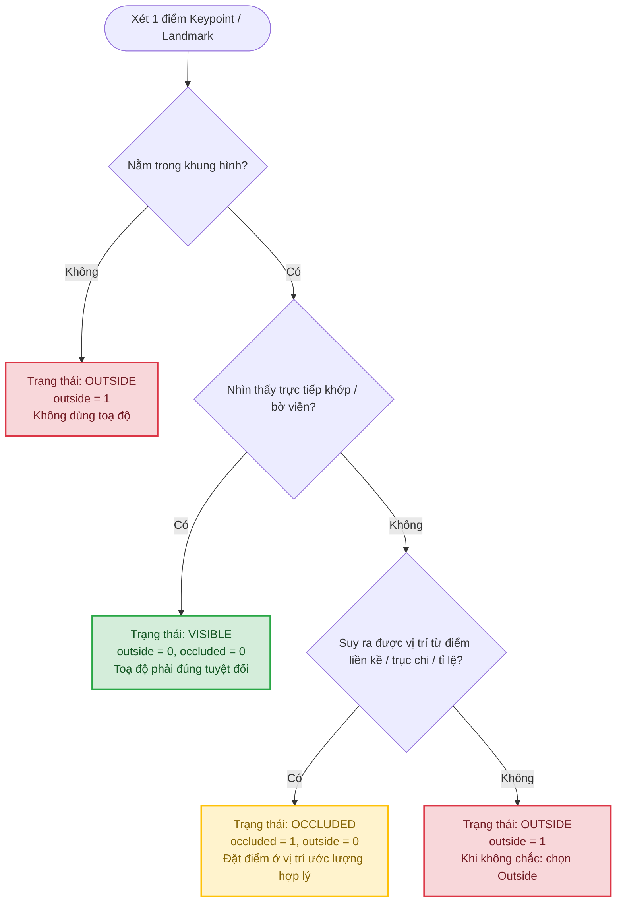
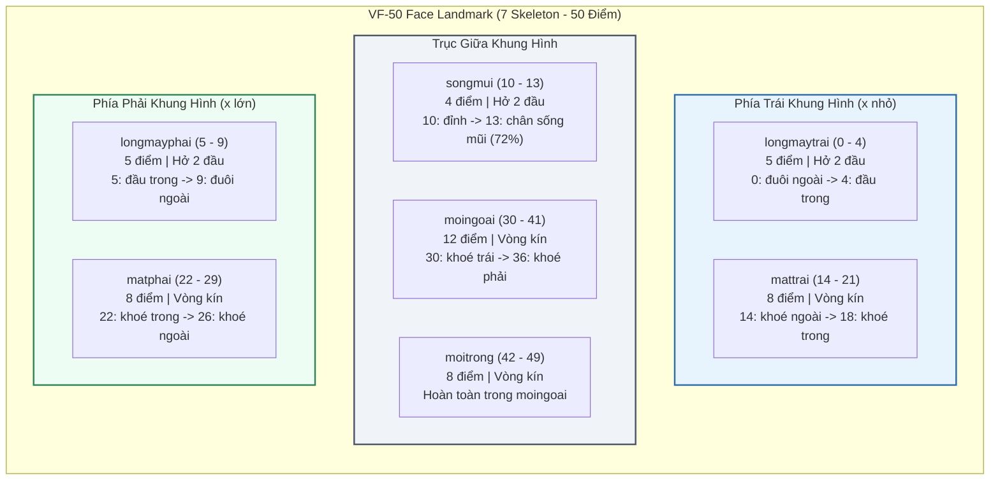
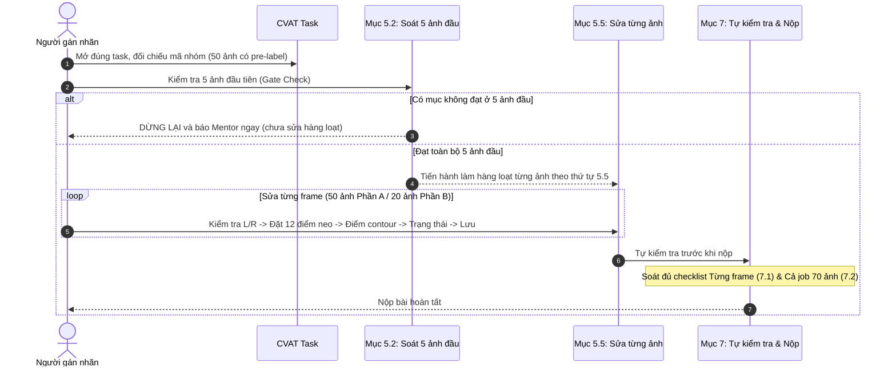
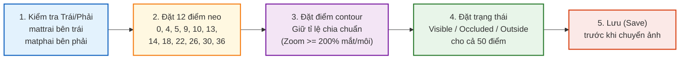
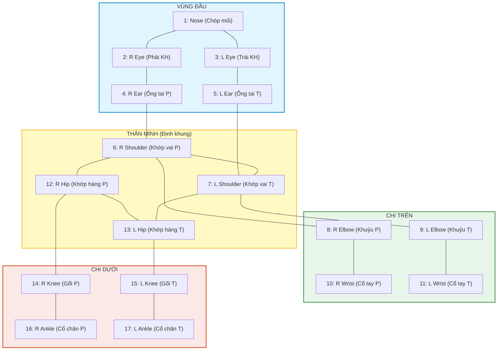
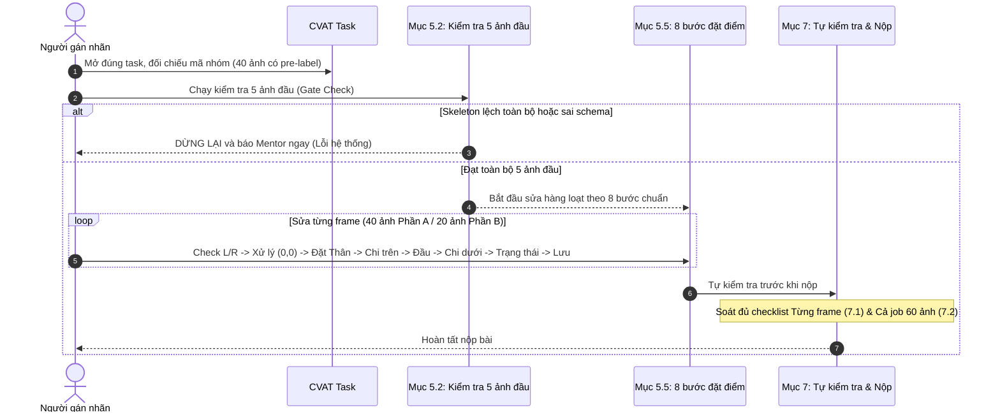
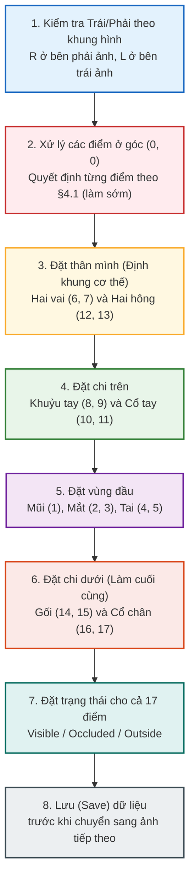
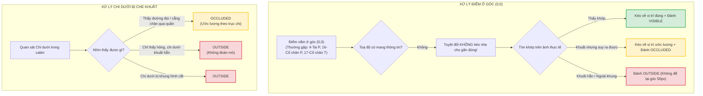

# BẢNG TRỰC QUAN HÓA CHECKLIST GÁN NHÃN (WEEK 2)
> **Nguồn trích xuất:** `thu_thach_tuan2/reports/Duy/ghi-chu.md`  
> **Tài liệu đối chiếu:** `Week2_Guideline_Face_Landmark_VF50_HocVien_v1.3.md` & `Week2_Guideline_HumanPose17_HocVien_v1.1.md`  
> **Nguyên tắc cốt lõi:** Xác định Trái (L) / Phải (R) theo **KHUNG HÌNH TRÊN ẢNH** (không theo giải phẫu người). Tuyệt đối không tự nạp annotation lên task. Không dùng Hidden thay cho Outside.

---

## MỤC LỤC TRỰC QUAN

1. [Cây Quyết Định Trạng Thái Điểm (Áp dụng chung)](#1-cây-quyết-định-trạng-thái-điểm-áp-dụng-chung)
2. [PHẦN 1: VF-50 Face Landmark (50 Landmark - 7 Skeleton)](#2-phần-1-vf-50-face-landmark-50-landmark---7-skeleton)
   - [2.1 Sơ đồ Cấu trúc & Phân bổ Point ID](#21-sơ-đồ-cấu-trúc--phân-bổ-point-id)
   - [2.2 Quy trình 4 bước thực hiện](#22-quy-trình-4-bước-thực-hiện)
   - [2.3 Quy trình 5 bước đặt điểm trong 1 ảnh](#23-quy-trình-5-bước-đặt-điểm-trong-1-ảnh)
   - [2.4 Bảng Checklist Kiểm Tra Chi Tiết Face Landmark](#24-bảng-checklist-kiểm-tra-chi-tiết-face-landmark)
   - [2.5 Ma trận Xử lý Tình huống đặc biệt & Ngưỡng Skeleton](#25-ma-trận-xử-lý-tình-huống-đặc-biệt--ngưỡng-skeleton)
   - [2.6 Bảng Tra cứu Lỗi Thường Gặp Face Landmark](#26-bảng-tra-cứu-lỗi-thường-gặp-face-landmark)
3. [PHẦN 2: HumanPose-17 Body Keypoints (17 Keypoints - 1 Skeleton)](#3-phần-2-humanpose-17-body-keypoints-17-keypoints---1-skeleton)
   - [3.1 Sơ đồ Topology & Quy tắc Khung hình VinFast](#31-sơ-đồ-topology--quy-tắc-khung-hình-vinfast)
   - [3.2 Quy trình 4 bước thực hiện](#32-quy-trình-4-bước-thực-hiện)
   - [3.3 Thứ tự 8 bước đặt điểm trong 1 ảnh](#33-thứ-tự-8-bước-đặt-điểm-trong-1-ảnh)
   - [3.4 Bảng Checklist Kiểm Tra Chi Tiết Human Pose](#34-bảng-checklist-kiểm-tra-chi-tiết-human-pose)
   - [3.5 Ma trận Xử lý Chùm điểm (0,0) & Chi dưới che khuất](#35-ma-trận-xử-lý-chùm-điểm-00--chi-dưới-che-khuất)
   - [3.6 Bảng Tra cứu Lỗi Thường Gặp Human Pose](#36-bảng-tra-cứu-lỗi-thường-gặp-human-pose)

---

## 1. Cây Quyết Định Trạng Thái Điểm (Áp dụng chung)

Quy tắc quyết định trạng thái điểm theo §4.1:

> **Lưu ý quan trọng:** Không dùng thuộc tính `Hidden` của CVAT thay cho `Outside`. Không dùng `confidence` để quyết định trạng thái.

---

## 2. PHẦN 1: VF-50 Face Landmark (50 Landmark - 7 Skeleton)

### 2.1 Sơ đồ Cấu trúc & Phân bổ Point ID

Quy ước: **KHÔNG CÓ BBOX FACE**. ID toàn cục chạy liên tục từ **0 đến 49**. Nhóm `*trai` nằm ở nửa trái ảnh (x nhỏ hơn), nhóm `*phai` nằm ở nửa phải ảnh.

---

### 2.2 Quy trình 4 bước thực hiện

---

### 2.3 Quy trình 5 bước đặt điểm trong 1 ảnh (Mục 5.5)

---

### 2.4 Bảng Checklist Kiểm Tra Chi Tiết Face Landmark

#### A. Gate Check: Soát 5 ảnh đầu trước khi làm hàng loạt (Mục 5.2)
- [ ] Có đủ **7 skeleton** trên mỗi frame (`longmaytrai`, `longmayphai`, `songmui`, `mattrai`, `matphai`, `moingoai`, `moitrong`).
- [ ] **Không có label Face** (đúng theo thiết kế hệ thống).
- [ ] Hai mắt tạo thành **vòng kín**, không có đường bắt chéo tạo thành hình chữ X.
- [ ] `mattrai` nằm ở **nửa trái khung hình**, `matphai` nằm ở **nửa phải khung hình**.
- [ ] Toạ độ `x` của các điểm từ **0 đến 9 tăng dần** khi mặt gần chính diện.
- [ ] `moitrong` nằm hoàn toàn **bên trong `moingoai`**.
- [ ] Không có điểm nào **rơi ra ngoài khuôn mặt**.

#### B. Kiểm tra từng bộ phận trên mỗi Frame (Ghi chú & Mục 3, 4, 7.1)
- [ ] **Trạng thái điểm (Point Status):**
  - [ ] Mọi điểm (50/50 điểm) đều đã được gán trạng thái rõ ràng (không để mặc định Visible của máy).
  - [ ] Điểm `Occluded` có toạ độ ước lượng hợp lý, không giữ nguyên vị trí sai lệch của pre-label.
  - [ ] Không có điểm nào gán `Hidden` thay vì `Outside`.
- [ ] **Lông mày (longmaytrai: 0–4, longmayphai: 5–9):**
  - [ ] Đã gán đủ tất cả các nhãn theo guideline.
  - [ ] Đặt điểm lên **mép lông** (bờ trên ranh giới với da trán), **không** đặt vào giữa đám lông, **không** đặt lên da trán.
  - [ ] Point ID của lông mày theo thứ tự tăng dần (`longmaytrai`: 0 ngoài -> 4 trong; `longmayphai`: 5 trong -> 9 ngoài).
  - [ ] Point ngoài sense đã đánh `Outside` (hoặc Outside cả skeleton nếu thấy dưới 3/5 điểm).
- [ ] **Sống mũi (songmui: 10–13):**
  - [ ] Điểm 10 đặt tại đỉnh sống mũi (lõm giữa 2 mắt, ngang khoé mắt trong).
  - [ ] **Điểm 13:** Nằm ở khoảng **72% quãng đường** từ điểm 10 xuống đường nối hai cánh mũi (nằm phía trên lỗ mũi, **chưa chạm chóp mũi**).
  - [ ] Ba đoạn 10–11, 11–12, 12–13 **chia gần đều nhau** (tỉ lệ max/min ~ 1.01).
- [ ] **Mắt (mattrai: 14–21, matphai: 22–29):**
  - [ ] Điểm đầu tiên của `mattrai` có ID = 14 (khoé ngoài); điểm đầu `matphai` có ID = 22 (khoé trong).
  - [ ] Điểm đầu chuỗi (14 hoặc 22) có toạ độ `x` **nhỏ nhất** trong 8 điểm của mắt đó.
  - [ ] Điểm khoé còn lại (18 hoặc 26) có toạ độ `x` **lớn nhất** trong 8 điểm của mắt đó.
  - [ ] **Mí trên cao hơn hoặc bằng mí dưới đối diện:**
    - `mattrai`: điểm 15 ≥ 21, điểm 16 ≥ 20, điểm 17 ≥ 19.
    - `matphai`: điểm 23 ≥ 29, điểm 24 ≥ 28, điểm 25 ≥ 27.
  - [ ] Contour là vòng kín, **không có đường bắt chéo tạo thành hình chữ X**.
  - [ ] Điểm đặt trên **bờ mi** (ranh giới da mi và nhãn cầu), không đặt lên lông mi hay lòng trắng.
- [ ] **Môi (moingoai: 30–41, moitrong: 42–49):**
  - [ ] Điểm 33 (môi trên) và điểm 39 (môi dưới) nằm **gần chính giữa miệng nhất**.
  - [ ] `moitrong` luôn **nằm hoàn toàn bên trong `moingoai`** ($x_{42} > x_{30}$ và $x_{46} < x_{36}$).
  - [ ] Khi **miệng đóng** (chiếm ~80% ảnh): **Không xoá** `moitrong`, giữ nguyên 8 điểm chạy dọc đường khép môi.
  - [ ] Khi **miệng mở**: Điểm đặt trên mép môi, không đặt lên răng/lưỡi.
- [ ] **Đeo kính & Vật cản:**
  - [ ] Điểm bờ mi bị gọng kính che: đặt lên bờ mi thật phía sau kính và đánh `Occluded`.
  - [ ] **Tuyệt đối không** đặt điểm lên gọng kính, tóc hoặc nền phía sau.
  - [ ] Nếu kính phản quang che kín không còn nhìn thấy khoé mắt nào: đánh `Outside` cả skeleton mắt.

#### C. Tự kiểm tra toàn bộ Job trước khi nộp (Mục 7.2)
- [ ] Đã hoàn thành đủ **70 ảnh** (50 ảnh phần A + 20 ảnh phần B).
- [ ] Đã đối chiếu Schema phần B: đúng **7 label**, **50 sublabel** (tên chuỗi số 0–49), tên trùng khít tuyệt đối với phần A.
- [ ] Đã rà soát kỹ ít nhất **10 frame đặc biệt**:
  - [ ] Ít nhất 1 frame mặt nghiêng mạnh.
  - [ ] Ít nhất 1 frame miệng mở.
  - [ ] Ít nhất 1 frame nheo mắt / nhắm mắt.
  - [ ] Ít nhất 1 frame kính loá / phản quang.
- [ ] Đã lướt toàn bộ job theo thứ tự frame để kiểm tra độ mượt, phát hiện điểm nhảy bất thường (**> 15 px**).
- [ ] Mọi trường hợp không chắc chắn đã **mở Issue** thay vì tự tiện đặt quy ước mới.

---

### 2.5 Ma trận Xử lý Tình huống đặc biệt & Ngưỡng Skeleton

| Skeleton / Tình huống | Điều kiện quan sát | Hành động xử lý | Trạng thái ghi nhận |
| :--- | :--- | :--- | :--- |
| **mattrai / matphai** | Thấy ≥ 4/8 điểm | Đặt đủ contour 8 điểm, điểm khuất suy luận từ bờ mi | Điểm thấy: `Visible` Điểm khuất: `Occluded` |
| **mattrai / matphai** | Thấy < 4/8 điểm | Không đoán mò | Đánh `Outside` cả skeleton |
| **longmaytrai / longmayphai** | Thấy ≥ 3/5 điểm | Đặt đủ cung lông mày theo mép trên | Điểm thấy: `Visible` Điểm khuất: `Occluded` |
| **longmaytrai / longmayphai** | Thấy < 3/5 điểm | Không đoán mò | Đánh `Outside` cả skeleton |
| **moingoai** | Thấy ≥ 6/12 điểm | Đặt đủ contour viền môi | Điểm khuất đánh `Occluded` |
| **moitrong** | Thấy ≥ 4/8 điểm | Đặt đủ mép trong môi | Điểm khuất đánh `Occluded` |
| **songmui** | Bị che một phần | Đặt 4 điểm chia đều; 13 ở chân sống mũi (72%) | Chỉ `Outside` khi cả sống mũi khuất hẳn |
| **Miệng đóng (80% ảnh)** | Hai môi khép sát | Đặt 8 điểm dọc đường khép môi, cho phép cặp đối diện trùng toạ độ y | `Visible` (Không xoá moitrong) |
| **Nheo / Nhắm mắt** | Mí khép lại | 8 điểm tạo vòng kín, mí trên & dưới trùng khe mí, giữ 2 khoé | `Visible` nếu thấy khe mí |
| **Gọng kính cắt mí** | Gọng đè lên mi | Đặt điểm lên bờ mi thật phía sau gọng | `Occluded` |

---

### 2.6 Bảng Tra cứu Lỗi Thường Gặp Face Landmark (Mục 9)

| Lỗi gặp phải | Nguyên nhân gốc rễ | Cách xử lý chuẩn xác |
| :--- | :--- | :--- |
| **Đi tìm label Face không thấy** | Tài liệu cũ mô tả sai | Schema thiết kế **không có Face**, chỉ dùng 7 skeleton. |
| **Đảo trái/phải toàn bộ job** | Dùng giải phẫu người hoặc đổi khi mặt nghiêng | Luôn giữ Left/Right theo **khung hình / khuôn mặt trên ảnh**. |
| **Mắt thành hình chữ X** | Sai thứ tự nối điểm | Kiểm tra và nối đúng vòng: 14→21 và 22→29. |
| **Đặt điểm 13 ở chóp mũi** | Nhầm định nghĩa chân sống mũi | Điểm 13 là **chân sống mũi** (ở 72% quãng đường từ 10 xuống cánh mũi, trên lỗ mũi). |
| **Xoá moitrong khi miệng đóng** | Tưởng miệng đóng là không có moitrong | Miệng đóng chiếm 80% ảnh; vẫn giữ đủ 8 điểm `moitrong` nằm trong `moingoai`. |
| **Đặt điểm lên gọng kính** | Gọng kính dễ nhìn hơn bờ mi | Phải đặt lên bờ mi thật rồi đánh trạng thái `Occluded`. |
| **Quên đặt trạng thái** | Pre-label đã để mặc định Visible | Phải rà soát và đặt mới toàn bộ trạng thái cho cả 50 điểm. |
| **Reset point ID theo từng skeleton** | Hiểu nhầm quy tắc sublabel | Point ID chạy **toàn cục 0–49** xuyên suốt 7 skeleton. |
| **Tự nạp annotation làm mất bài** | Upload file ghi đè dữ liệu task | Tuyệt đối **không dùng nút upload annotation**. |
| **Copy nhãn giữa các frame liên tiếp** | Thấy các ảnh liên tiếp gần giống nhau | Không copy nguyên nhãn; nhãn mượt nhưng phải kiểm tra từng frame. |
| **Schema phần B sublabel 0–7** | Reset ID theo từng skeleton | Dùng đúng ID toàn cục (ví dụ `mattrai` là 14–21). |
| **Hai người cùng sửa Labels** | Không phân công ai phụ trách | Một người dựng/đối chiếu, cả nhóm kiểm tra. |
| **Chia đôi frame máy móc tìm L/R** | Khuôn mặt lệch khỏi tâm ảnh | Xác định trái/phải theo **bố cục khuôn mặt trên ảnh**, không theo tâm frame. |

---

## 3. PHẦN 2: HumanPose-17 Body Keypoints (17 Keypoints - 1 Skeleton)

### 3.1 Sơ đồ Topology & Quy tắc Khung hình VinFast

Quy ước: **Chỉ gán người lái**. Trái/Phải theo **KHUNG HÌNH** (R ở bên phải ảnh, L ở bên trái ảnh).
- Điểm chẵn (**R**): 2, 4, 6, 8, 10, 12, 14, 16 nằm ở phía **PHẢI** khung hình.
- Điểm lẻ (**L**): 3, 5, 7, 9, 11, 13, 15, 17 nằm ở phía **TRÁI** khung hình.

---

### 3.2 Quy trình 4 bước thực hiện

---

### 3.3 Thứ tự 8 bước đặt điểm trong 1 ảnh (Mục 5.5)

---

### 3.4 Bảng Checklist Kiểm Tra Chi Tiết Human Pose

#### A. Gate Check: Soát 5 ảnh đầu trước khi làm hàng loạt (Mục 5.2)
- [ ] Có skeleton `person` với **đủ 17 sublabel** được đánh số từ **1 đến 17**.
- [ ] Số lượng skeleton **khớp số người cần gán**: Mặc định duy nhất **1 người lái**.
- [ ] **Không có skeleton nào lệch toàn bộ** so với người trong ảnh (nếu dịch chuyển cả cụm -> báo mentor).
- [ ] Đã nhận diện được **chùm điểm lỗi ở góc trên-trái (0, 0)**.
- [ ] Trái/phải **chưa bị đảo**: Điểm R ở phía phải khung hình, điểm L ở phía trái khung hình.

#### B. Kiểm tra từng bộ phận trên mỗi Frame (Ghi chú & Mục 3, 6, 7.1)
- [ ] **Quy tắc khung hình & Không gian:**
  - [ ] Điểm R (chẵn) ở bên phải ảnh, điểm L (lẻ) ở bên trái ảnh (bất kể người vặn mình, quay lưng).
  - [ ] Ảnh bị xoay 90°: Xác định đầu–chân theo cơ thể, nhưng **Left/Right vẫn theo khung hình**.
  - [ ] Duy nhất 1 skeleton cho người lái; **không gán nhãn hành khách/người thứ 2**.
- [ ] **Xử lý chùm điểm góc (0, 0) & Trùng toạ độ:**
  - [ ] Không còn bất kỳ điểm nào nằm ở góc (0, 0) hoặc sát góc trên-trái (**vùng 50 px**).
  - [ ] Không kéo nhẹ điểm (0, 0) cho gần đúng; phải xác định lại từ đầu trên ảnh.
  - [ ] **Không có hai điểm khác nhau trùng toạ độ** khi cả hai đều `Visible` (ví dụ tai đè lên mũi).
- [ ] **Vùng đầu (Keypoint 1–5):**
  - [ ] **1 - Nose:** Đặt ở **chóp mũi** (mặt nghiêng vẫn là chóp mũi, không dời về giữa mặt).
  - [ ] **2 - R Eye / 3 - L Eye:** Đặt ở **tâm đồng tử** mắt; nếu mắt nhắm đặt ở **tâm khe mí**.
  - [ ] **4 - R Ear / 5 - L Ear:** Đặt ở **ống tai** (không đặt ở chóp vành tai hay dái tai).
  - [ ] Khi tóc phủ kín tai: Nếu còn ước lượng được từ hàm/thái dương -> đánh `Occluded`, không thì `Outside`.
- [ ] **Chi trên (Keypoint 6–11):**
  - [ ] **6 - R Shoulder / 7 - L Shoulder:** Đặt tại **tâm khớp vai** (điểm xoay cánh tay).
  - [ ] **8 - R Elbow / 9 - L Elbow:** Đặt tại **tâm khớp khuỷu tay**.
  - [ ] **10 - R Wrist / 11 - L Wrist:** Đặt tại **tâm khớp cổ tay** (nếp gấp cổ tay).
  - [ ] **Tay đặt trên vô-lăng:** Cổ tay vẫn đặt ở **nếp gấp cổ tay**, **tuyệt đối không** dời lên vành vô-lăng.
  - [ ] Chuỗi vai – khuỷu – cổ tay liền mạch, **không bắt chéo** sang bên kia thân.
- [ ] **Chi dưới (Keypoint 12–17):**
  - [ ] **12 - R Hip / 13 - L Hip:** Đặt tại **tâm khớp háng** (không phải mép ngoài hông hay cạp quần).
  - [ ] **14 - R Knee / 15 - L Knee:** Đặt tại **tâm khớp gối** (giữa xương bánh chè).
  - [ ] **16 - R Ankle / 17 - L Ankle:** Đặt tại **tâm khớp cổ chân** (ngang mắt cá).
  - [ ] Kiểm tra từng điểm gối và cổ chân xem có **nằm trên cơ thể người** không.
  - [ ] **Tuyệt đối không** đặt điểm lên ghế, vô-lăng, cần số, bảng táp-lô hay sàn xe.
- [ ] **Trạng thái điểm (Point Status):**
  - [ ] Đủ 17 keypoint, mỗi điểm có trạng thái rõ ràng (`Visible`, `Occluded`, `Outside`).
  - [ ] Điểm `Occluded` có toạ độ ước lượng hợp lý theo trục chi / tư thế.
  - [ ] Điểm `Outside` đúng là nằm ngoài khung hình hoặc hoàn toàn không suy ra được.

#### C. Tự kiểm tra toàn bộ Job trước khi nộp (Mục 7.2)
- [ ] Đã hoàn thành đủ **60 ảnh** (40 ảnh phần A + 20 ảnh phần B).
- [ ] Đã đối chiếu Schema phần B: đúng **1 label person**, **17 sublabel** (số 1 đến 17), tên trùng khít tuyệt đối với phần A.
- [ ] Đã rà soát kỹ ít nhất **10 frame đặc biệt**:
  - [ ] 1 frame chi dưới bị khuất.
  - [ ] 1 frame người lái vặn mình / quay lưng.
  - [ ] 1 frame thiếu sáng / nhoè.
  - [ ] 1 frame pre-label có nhiều điểm dồn ở (0, 0).
- [ ] Mọi trường hợp nghi ngờ, không chắc chắn (ví dụ quá tối không phân biệt được người với ghế) đã **mở Issue** thay vì tự đặt luật mới.

---

### 3.5 Ma trận Xử lý Chùm điểm (0,0) & Chi dưới che khuất

---

### 3.6 Bảng Tra cứu Lỗi Thường Gặp Human Pose (Mục 9)

| Lỗi gặp phải | Nguyên nhân gốc rễ | Cách xử lý chuẩn xác |
| :--- | :--- | :--- |
| **Đảo trái/phải toàn bộ job** | Dùng quy ước giải phẫu/COCO thay vì quy ước VinFast | Điểm **R phải ở bên phải ảnh**, điểm **L phải ở bên trái ảnh**. |
| **Kéo điểm (0, 0) cho gần đúng** | Tưởng toạ độ (0, 0) có ý nghĩa | Toạ độ máy vứt ở góc là vô nghĩa; phải tự xác định lại từ đầu trên người thật. |
| **Đặt gối / cổ chân lên ghế, cần số** | Cần tìm chỗ để ghim điểm | Nếu không thấy chi trên người thì đánh `Outside`, không đặt lên vật thể. |
| **Đặt cổ tay lên vành vô-lăng** | Vành vô-lăng dễ nhìn hơn cổ tay | Cổ tay phải đặt tại **nếp gấp cổ tay**. |
| **Đặt hông ở cạp quần** | Nhầm mốc giải phẫu | Hông là **tâm khớp háng**, không phải cạp quần hay mép ngoài hông. |
| **Đặt tai ở chóp vành tai** | Nhầm mốc giải phẫu | Tai là **ống tai**, không phải vành tai hay dái tai. |
| **Nhầm trên/dưới cơ thể khi xoay 90°** | Khung hình bị xoay ngang | Xác định đầu–chân theo trục cơ thể, nhưng **Left/Right vẫn giữ theo khung hình**. |
| **Dùng Hidden thay Outside** | Nhầm lẫn chức năng của CVAT | `Hidden` chỉ ẩn tạm trên giao diện không lưu data; phải chọn thuộc tính `Outside`. |
| **Gán nhãn cả hành khách** | Thấy người thứ 2 trong cabin | Mặc định **chỉ gán nhãn duy nhất người lái**. |
| **Sửa tay 40 ảnh bị lệch hệ thống** | Không nhận ra toàn bộ skeleton bị dịch | Cả skeleton lệch đều sang một bên là lỗi hệ thống -> **báo ngay cho Mentor**. |
| **Schema phần B đặt node R/L sai phía** | Dùng thói quen giải phẫu / COCO | Node R ở nửa phải, node L ở nửa trái khung vẽ trình dựng. |
| **Hai người cùng sửa Labels** | Không phân công ai dựng | Một người dựng schema, cả nhóm đối chiếu kiểm tra. |
